<div align="center">

<a href="https://tilakpatell.com">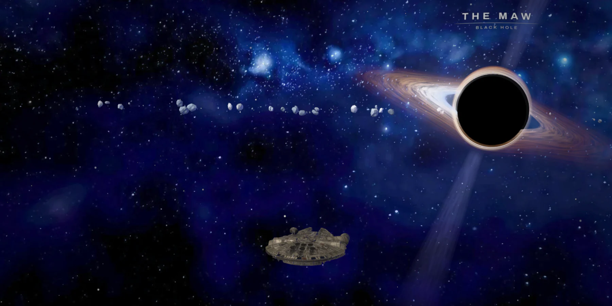</a>

# tilakpatell.com

**Tilak Patel's portfolio. A résumé on the surface, and underneath it a universe you can fly through.**

A 3D map of the whole site with a starfighter to fly it, thirteen fan-made worlds to land on and walk (one of them a whole Star Wars galaxy), games, and online multiplayer. All of it runs on a static site.

[**Visit tilakpatell.com →**](https://tilakpatell.com)&nbsp;&nbsp;·&nbsp;&nbsp;[Résumé (PDF)](public/Resume.pdf)&nbsp;&nbsp;·&nbsp;&nbsp;[LinkedIn](https://www.linkedin.com/in/tilakpatell)&nbsp;&nbsp;·&nbsp;&nbsp;[Email](mailto:tilakny@gmail.com)

[](https://github.com/tilakpatell/new-portfolio-website/actions/workflows/deploy.yml)


</div>

---

## Contents

- [Hi, I'm Tilak](#hi-im-tilak)
- [Two ways in](#two-ways-in)
- [The portfolio](#the-portfolio)
- [The universe](#the-universe)
- [A galaxy far, far away](#a-galaxy-far-far-away)
- [The hidden worlds](#the-hidden-worlds)
- [Easter eggs](#easter-eggs)
- [Credits](#credits)
- [Under the hood](#under-the-hood): tech stack, running it, scripts, structure, how it works, deployment, the autopilot
- [Disclaimer](#disclaimer)

## Hi, I'm Tilak


I plan technical programs and build the software behind them: capacity planning at AWS, a modernization roadmap at RTX, and engineering at Bose, Pendar, Empowerreg and SRC.

I study computer science at Northeastern University (B.S., graduating May 2027), and right now I'm a Technical Infrastructure Program Manager Intern at AWS, building data-center planning tools for generative-AI capacity. Off the clock: Game Boy emulators, open source, and an unreasonable amount of Star Wars. This site is where those meet.

**Open to technical program manager and software engineer roles.** [Say hello](mailto:tilakny@gmail.com).

<br clear="right">

### Where I've worked

| | Role | What I did |
| --- | --- | --- |
| **AWS** | Technical Infrastructure Program Manager Intern<br><sub>Herndon, VA · Sep 2026 – now</sub> | Data-center planning tools that model server-placement constraints for generative-AI capacity; a Python multi-agent pipeline that queries Redshift over MCP to flag stale capacity data and notify its owners |
| **RTX** | Application Transformation Intern<br><sub>Hartford, CT · Jun – Aug 2026</sub> | Helped design the application-modernization value stream and roadmap behind RTX's 2028 enterprise goals, and moved workloads onto its Xeta Cloud platform |
| **Bose** | Software Engineer Co-op<br><sub>Framingham, MA · Jan – Jun 2026</sub> | A full-stack log-analysis platform (60+ FastAPI endpoints, a three-phase pipeline with 25+ tools) that took firmware debugging from hours to minutes; a React, Electron and Copilot SDK desktop app |
| **Pendar** | Laser Software Engineer Co-op<br><sub>Boston, MA · Jul – Dec 2025</sub> | A real-time Qt/PySide6 acquisition app for laser sensor testing that fully replaced a legacy LabVIEW system, with automated overnight runs |
| **Empowerreg AI** | AI Engineer Intern<br><sub>Remote · Jul – Dec 2025</sub> | FDA complaint-severity heatmaps, a Grafana and Loki stack across 5+ microservices, and an assistant that saves analysts 4+ hours a week |
| **SRC, Inc.** | Machine Learning Engineer Intern<br><sub>Syracuse, NY · Apr – Jul 2025</sub> | A pipeline extracting knowledge triplets from 500+ radar documents at 90% accuracy, fed into LangGraph knowledge graphs that cut review time by 70% |

### Things I've built

| Project | What it is | Built with |
| --- | --- | --- |
| [**Game Boy Emulator**](https://github.com/tilakpatell/gameboy-emulator) | All 500+ LR35902 opcodes, a scanline PPU, ROMs at 60 FPS, and it passes Blargg's CPU test suite. [Playable on the site](https://tilakpatell.com/projects/gameboy-emulator) | C++, SDL3, CMake |
| [**Swaminarayan Translator**](https://tilakpatell.com/projects/swaminarayan-translator) | An AI translation workbench that turns scanned Gujarati, Hindi and Sanskrit books into typeset English editions: OCR, layout analysis and page-by-page translation with Claude, checked side by side | Python, FastAPI, React, PostgreSQL, Claude API |
| [**DevSpace**](https://github.com/shreyaanpathak/DevSpace) · *HackBeanpot 1st place* | A collaborative cloud IDE with GPU-accelerated Docker execution on a Jetson Nano and real-time multi-user editing, built with [@shreyaanpathak](https://github.com/shreyaanpathak) | Java, Spring Boot, React, Docker, CUDA |
| [**github/awesome-copilot**](https://github.com/github/awesome-copilot/pull/1388) | Error-recovery hooks and PyInstaller frozen-build recipes for the Copilot SDK, merged into GitHub's official repository | Python, Copilot SDK |
| **GPU checkpoint-restart** · *research* | With Prof. Gene Cooperman: profiling MPI checkpoint-restart in MANA, and checkpoint-restart for NCCL collectives toward fault recovery in multi-GPU training | C, MPI, NCCL |
| **Systems coursework** | A [FUSE file system](https://github.com/tilakpatell/File-System-Project) and a [Unix shell](https://github.com/tilakpatell/Shell-Project) in C | C, POSIX |

**Toolkit:** Python, C/C++, Java, C#/.NET, SQL, x86 assembly, JavaScript · FastAPI, Spring Boot, React, Node.js, PyTorch, LangGraph, Qt/PySide6 · AWS (Redshift, Bedrock), Docker, Linux, GitHub Actions, MongoDB, Grafana, MCP

## Two ways in

The switch at the top of every page moves between the two, landing on the same place in the other, and the front door opens on whichever you picked last.

<table>
<tr>
<td width="50%" valign="top">
<a href="https://tilakpatell.com/home"></a>
<p><b>Classic</b>: the portfolio as plain, fast pages. Everything a recruiter needs, in one scroll.</p>
</td>
<td width="50%" valign="top">
<a href="https://tilakpatell.com/universe">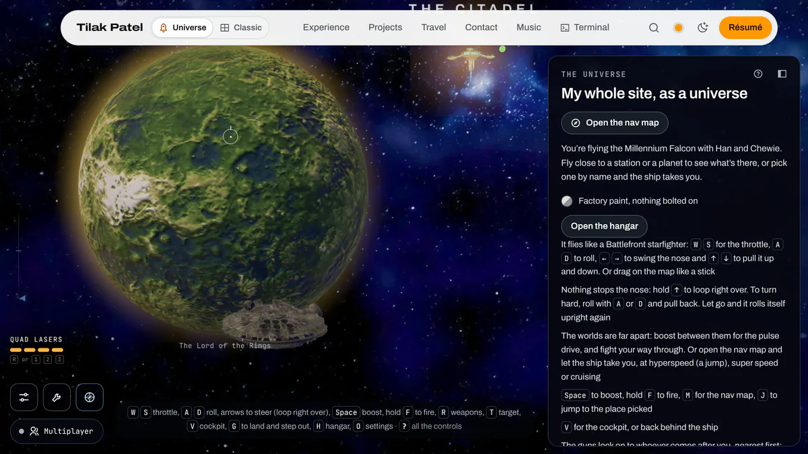</a>
<p><b>Universe</b>: the same site as places in space. Fly to a planet to open its page.</p>
</td>
</tr>
</table>

## The portfolio

<table>
<tr>
<td width="50%" valign="top"><a href="https://tilakpatell.com/experience/bose"></a><p><b>Experience.</b> The whole site takes on each company's colours as its role scrolls by.</p></td>
<td width="50%" valign="top"><a href="https://tilakpatell.com/projects">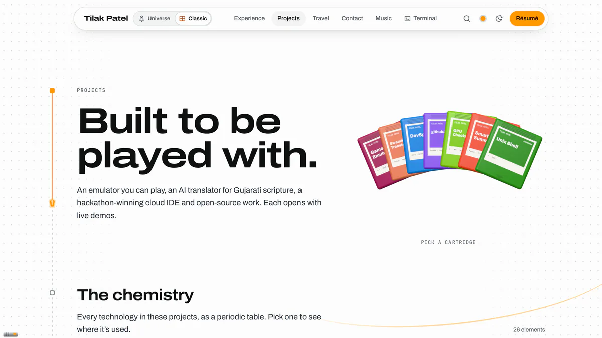</a><p><b>Projects.</b> A hand of 3D cartridges, one per project. The Game Boy one boots a playable emulator.</p></td>
</tr>
<tr>
<td width="50%" valign="top"><a href="https://tilakpatell.com/travel">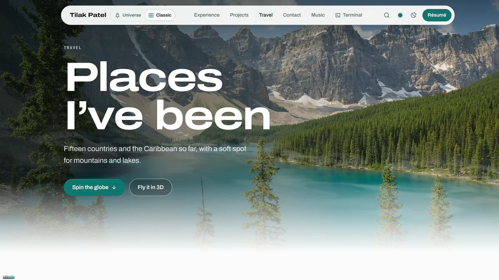</a><p><b>Travel.</b> Fifteen countries and the Caribbean so far, on a globe to spin, with photos from each.</p></td>
<td width="50%" valign="top"><a href="https://tilakpatell.com/resume">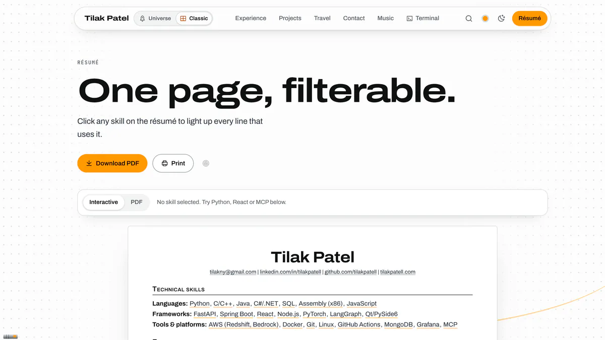</a><p><b>Résumé.</b> One page, filterable by skill, with the PDF a click away.</p></td>
</tr>
<tr>
<td width="50%" valign="top"><a href="https://tilakpatell.com/contact"></a><p><b>Contact.</b> A paper airplane folded from the memo pad. Send the memo and it takes off.</p></td>
<td width="50%" valign="top"><a href="https://tilakpatell.com/terminal">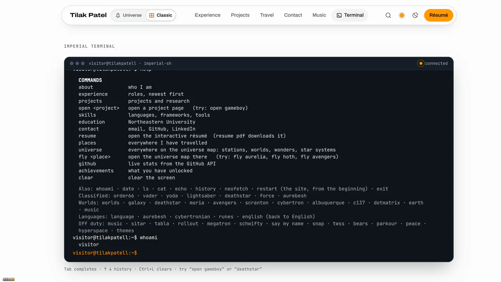</a><p><b>Terminal.</b> The same content, as an Imperial terminal. Try <code>help</code>, or <code>fly hoth</code>.</p></td>
</tr>
</table>

| Page | Route | What it shows |
| --- | --- | --- |
| Home | [`/home`](https://tilakpatell.com/home) | Intro, focus areas and a live GitHub activity snapshot |
| Experience | [`/experience`](https://tilakpatell.com/experience) | Every role, from AWS to SRC. The site's theme changes to each company's colours as its role scrolls past |
| Projects | [`/projects`](https://tilakpatell.com/projects) | Case studies, each with a live demo. The Game Boy emulator one is playable. It opens on a hand of 3D game cartridges, one per project: point at one to lift it, click to open it |
| Résumé | [`/resume`](https://tilakpatell.com/resume) | The résumé on the page, plus a PDF download |
| Travel | [`/travel`](https://tilakpatell.com/travel) | A 3D globe of places visited, with photos |
| Contact | [`/contact`](https://tilakpatell.com/contact) | How to reach me, with a paper airplane folded from the memo pad gliding by the heading (it takes off when the memo's sent) |
| Terminal | [`/terminal`](https://tilakpatell.com/terminal) | An Imperial terminal that takes commands (try `help`, or `fly hoth`) |
| Changes | [`/changes`](https://tilakpatell.com/changes) | The ship's log: every change the site's autopilot has made, with a picture, and how to undo it |

The six pages are one feed: scroll to the end of any of them and the next begins under it, with a divider saying what comes next, and the address, the menu and the theme follow whichever page is on screen. After the sixth, an end card. Each page is still its own address, so every link works as before.

All of the content (roles, projects, skills, education) lives in [`src/data/`](src/data). Every page and the terminal read from there.

## The universe

<a href="https://tilakpatell.com/universe">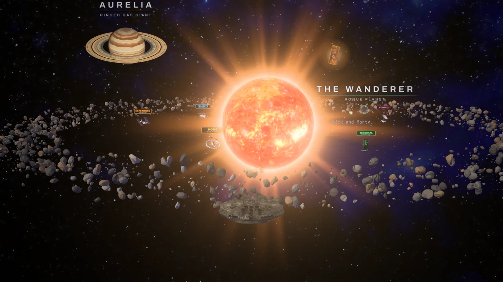</a>

The front door (`/`) is a map of the whole site as places in space: the portfolio's pages are stations round a sun, and each fandom is a planet out in the dark. A first visit opens with a crawl, then puts you in a cockpit (the Millennium Falcon, an X-wing, Rick's space cruiser or Walt and Jesse's RV) and launches you into the map. Fly to a planet to open its page.

<table>
<tr>
<td width="50%" valign="top">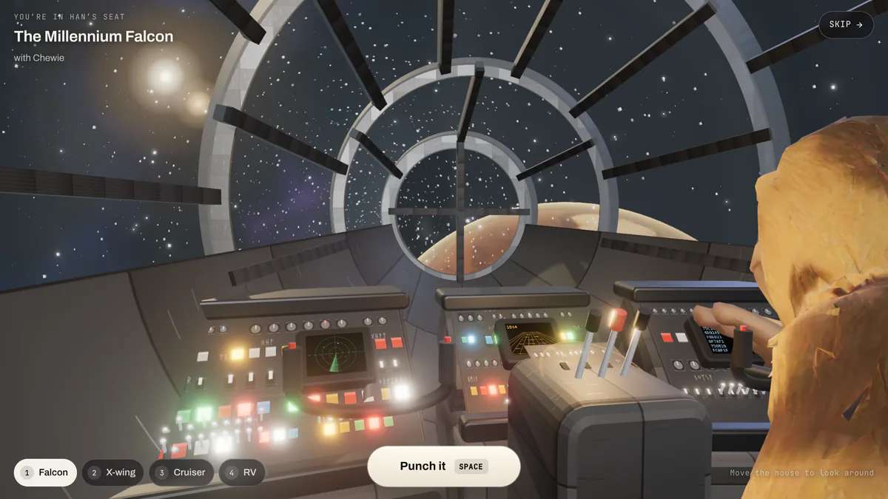<p><b>The welcome.</b> A first visit puts you in the pilot's seat (Han's, with Chewie beside you), then you punch it.</p></td>
<td width="50%" valign="top">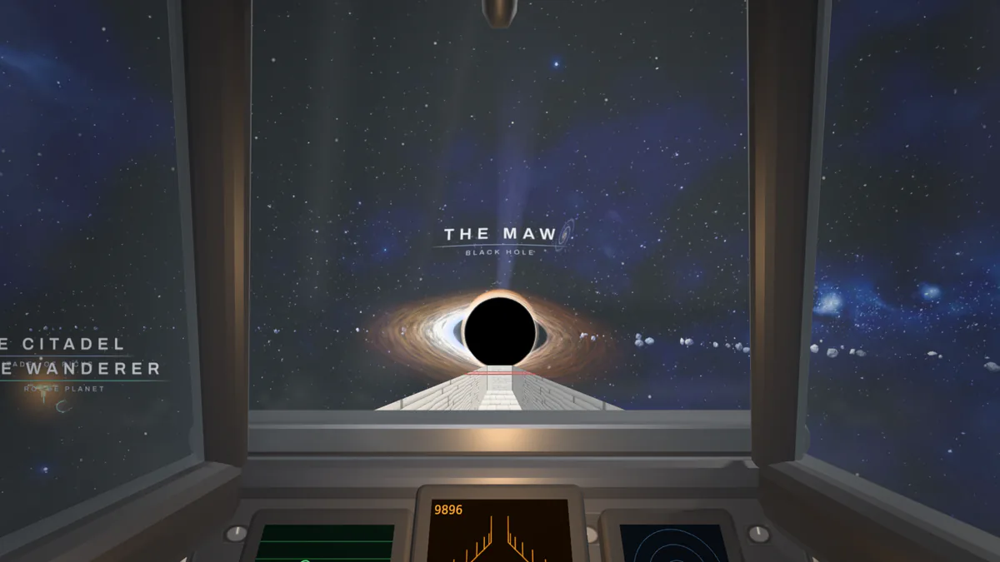<p><b>From the cockpit</b> (<code>V</code>): every ship has its own, with the crew aboard.</p></td>
</tr>
<tr>
<td width="50%" valign="top">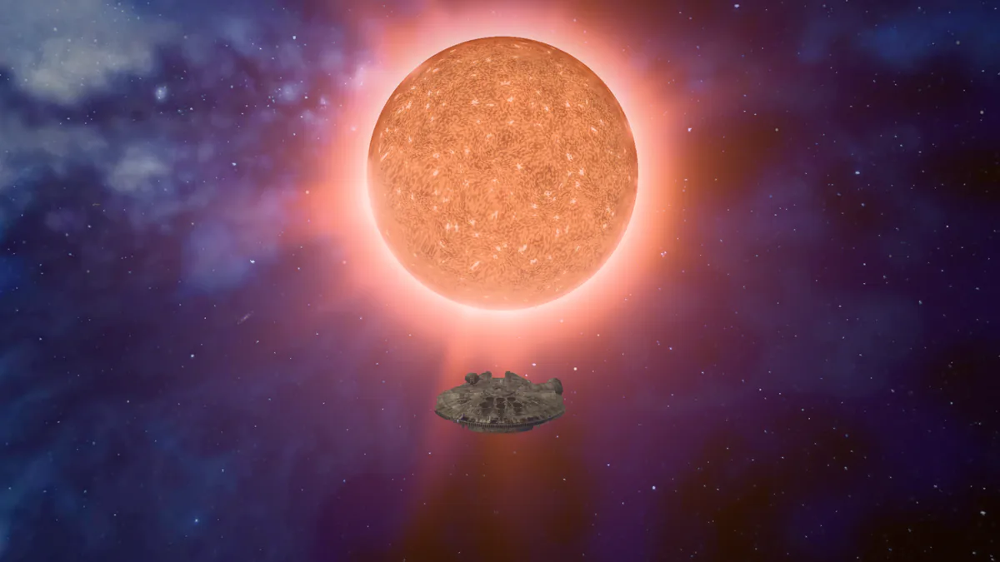<p><b>Ember</b>, a red star with worlds of its own, one of the wonders out past the planets.</p></td>
<td width="50%" valign="top">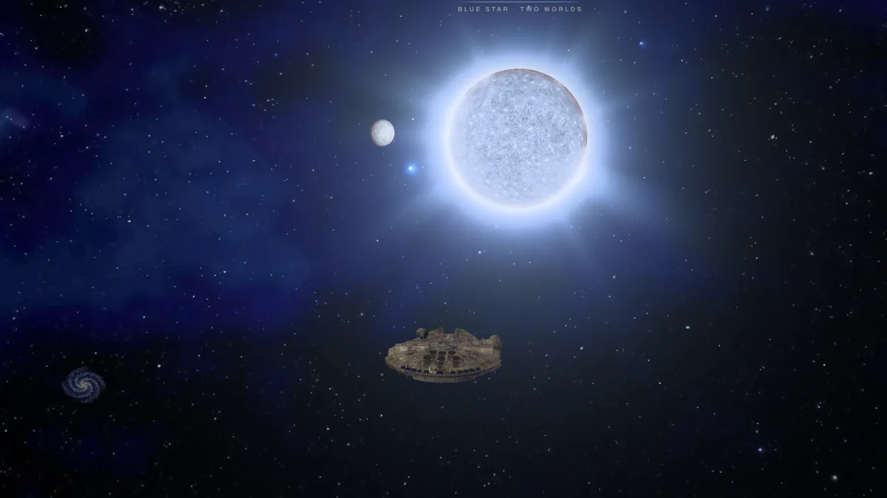<p><b>Halcyon</b>, a blue star with two worlds.</p></td>
</tr>
<tr>
<td width="50%" valign="top">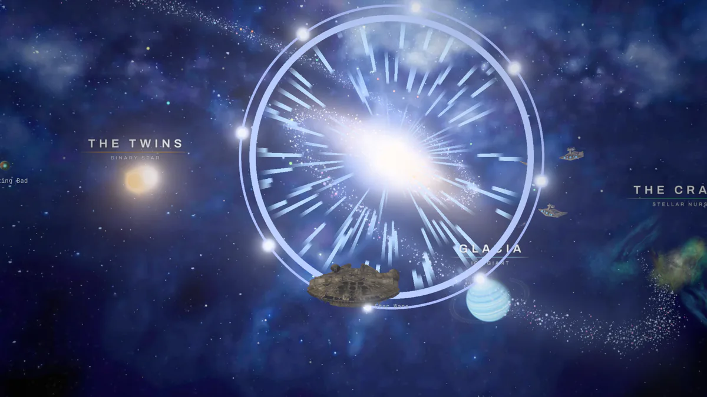<p><b>The gate to a galaxy far, far away.</b> Star Wars isn't a planet but a galaxy of its own, behind a hyperspace gate.</p></td>
<td width="50%" valign="top">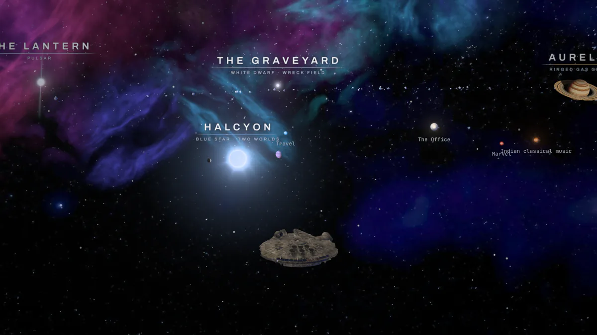<p><b>Deep space</b>: two nebulae, a pulsar, a binary star, a wreck field round a white dwarf.</p></td>
</tr>
<tr>
<td width="50%" valign="top">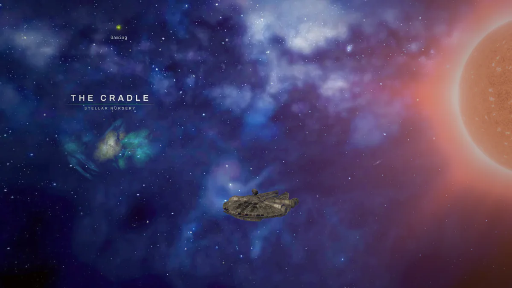<p><b>The Cradle</b>, a stellar nursery, from the Falcon on its way past Ember.</p></td>
<td width="50%" valign="top">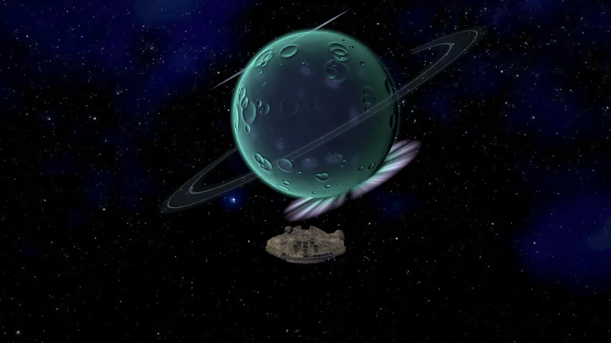<p><b>The Wanderer</b>, a rogue planet with no sun, out on its own.</p></td>
</tr>
</table>

<table>
<tr>
<td width="33%" valign="top">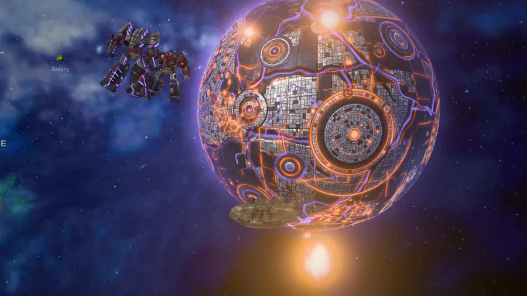<p><b>Cybertron</b></p></td>
<td width="33%" valign="top">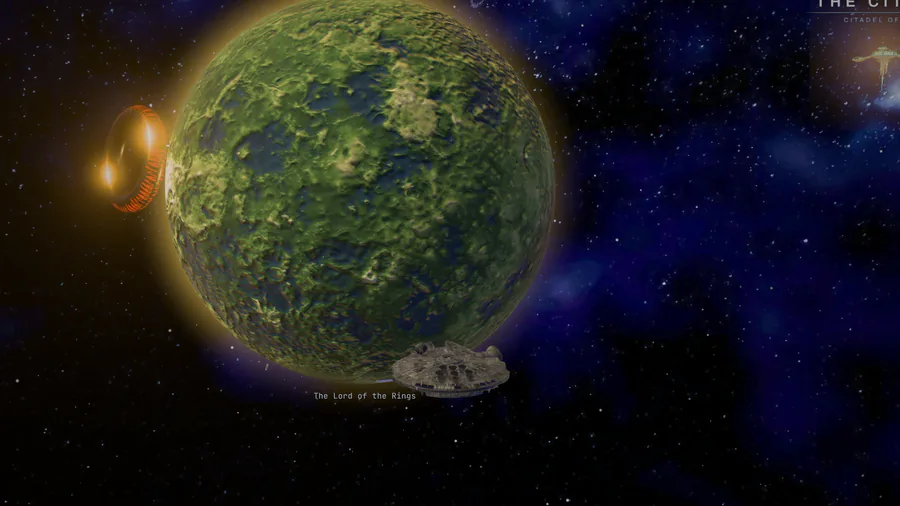<p><b>Middle-earth</b>, with the Ring in orbit</p></td>
<td width="33%" valign="top">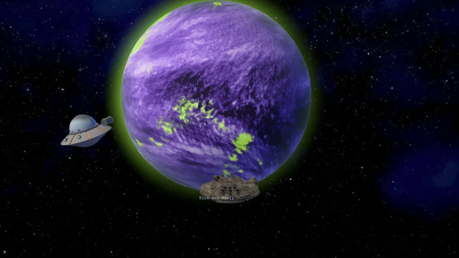<p><b>Dimension C-137</b></p></td>
</tr>
</table>

<a href="https://tilakpatell.com/universe">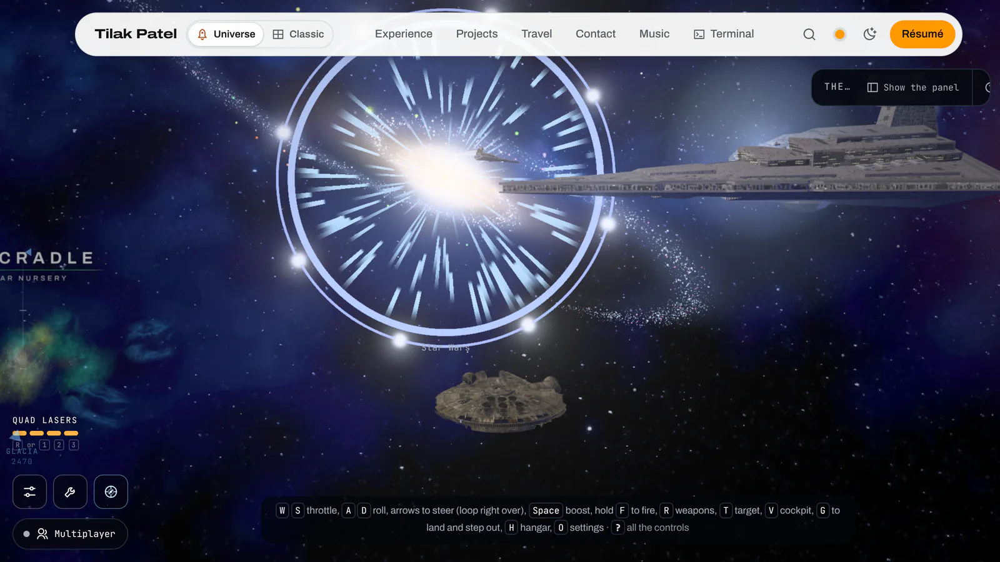</a>

<p align="center"><sub>Things happen while you fly. Here a Star Destroyer drops out of hyperspace by the gate, about to launch its TIE fighters.</sub></p>

<table>
<tr>
<td width="50%" valign="top">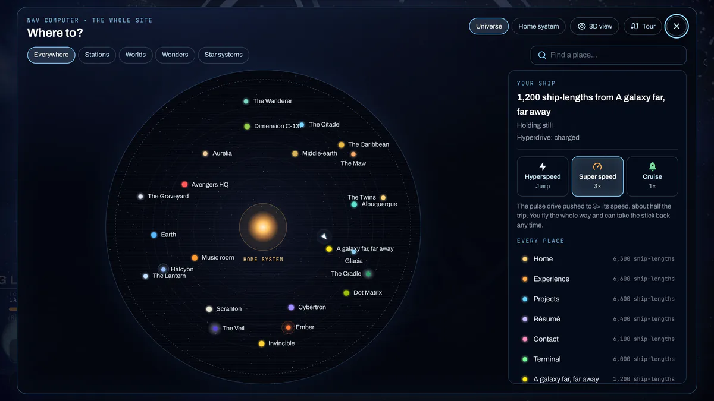<p><b>The nav map</b> (<code>M</code>): everywhere on one chart. Pick a place and a drive, and see the trip time for each.</p></td>
<td width="50%" valign="top">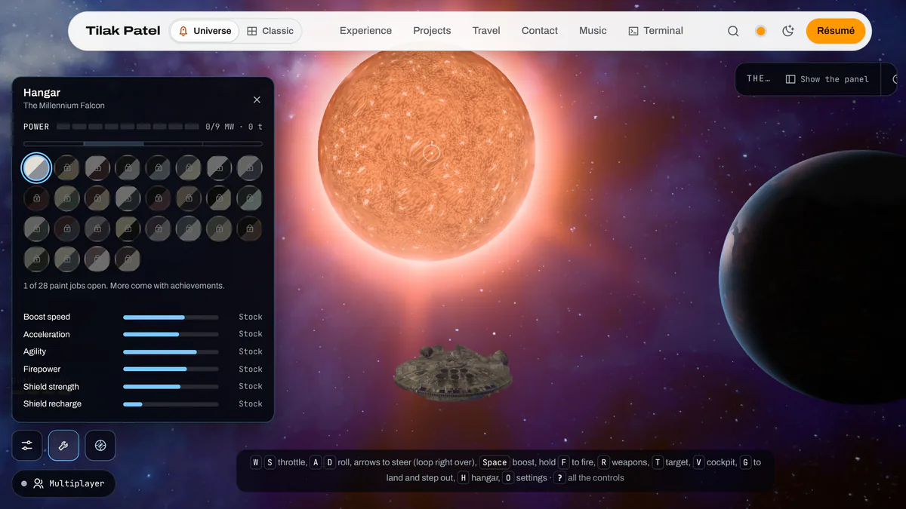<p><b>The hangar</b> (<code>H</code>): paint and parts, each changing how the ship flies, and a shipyard to build your own.</p></td>
</tr>
</table>

<details>
<summary><b>Flight controls</b></summary>

| Key | Action |
| --- | --- |
| `W` / `S` | Throttle |
| `A` / `D` | Roll |
| `←` `→` `↑` `↓` | Turn and pitch the nose |
| `F` (hold) | Fire |
| `R` / `1` `2` `3` | Change weapons: blaster, spread, heavy ordnance |
| `T` / `Q` | Next / previous target |
| `V` | Switch between the chase camera and the cockpit view |
| `O` | Flight settings (steering, aim assist, lock tracking, inverted pitch and more) |
| `H` | The hangar: paint and parts for the ship you're flying |
| `G` | Fly down into the air of the planet you're at, to land (and, on foot, get back in) |
| `M` | The nav map: everywhere on one chart. Pick a place and a drive (hyperspeed, a jump; super speed, 3× the pulse drive; or cruise), with the trip time for each. The galaxy's star systems are on it too (the ship flies to the gate and on through), every place has a link that opens the map right there, and Tour takes you round everything in turn |
| `J` | Jump to the place picked at hyperspeed |

To land on a planet, fly down into its air: the glow round it. Come in at a normal speed and you're taken in, the way the galaxy's worlds come down: the hull burning as it hits the air, the planet's own sky coming up round you, through the clouds, and out over the planet's landing, where the ship sets down and the crew step out (`G`, or Land on a phone, flies the ship in for you). Come in boosting and there's no landing: it's a crash, and the crash takes you into the planet's world as it always has.

On foot, `W` `A` `S` `D` walk, `Shift` runs, `Space` jumps, `F` or a click fires, `X` switches to the other one of your crew and `V` looks out of their eyes.

</details>

<details>
<summary><b>Landing, the hangar and the shipyard</b></summary>

Every planet is its own place down there, under its own sky: Middle-earth's is the Shire on the day of the party, Breaking Bad's the desert where the RV cooks, Rick and Morty's the Smiths' street with a portal open on the lawn, Cybertron's plating under Kaon's towers, the Avengers compound with the Quinjet on its pad, the lot out back of Dunder Mifflin, Dot Matrix in four greens with a cartridge for each project, a sandstone courtyard at dusk for the music, an airfield on Earth with a signpost to every place I've been, a Caribbean beach with the Black Pearl at anchor, and the Graysons' city round Omni-Man's crater. People stand about and have a line for you when you come up to them (Gandalf, Saul, Jerry, Dwight, Thor, Jack…), and every landing has a door: walk up to it (Bag End's, the RV, the portal, the Game Boy, the plane…) and `G` takes you into that world's page. The Galactic Federation's squads come over the horizon now and then. On the Death Star you come down beside its trench, on hull plating with blocks and towers standing on it, and can walk up to the rim and look down into the trench run.

The hangar fits each ship out its own way, like a space sim's outfitting screen, and remembers it. Paint jobs are the site's own colour schemes: the six companies' come with the Cartographer achievement, and each fan scheme's with the easter egg that unlocks it. Parts bolt on and change how it flies and fights: strap-on boosters (solid rockets, an afterburner, repulsor pods, portal-fluid tanks), thrusters, twin or fusion guns, plating or fast-charge shields, and fins. Each draws power from the ship's plant and adds mass, so you can't fit the best of everything; the best parts are earned with achievements in the worlds. Other pilots see your paint and parts. The X-wing and the Falcon you fly are other people's models from Sketchfab (CC BY, credited on the map and in [CREDITS.md](CREDITS.md)), brought to web size by `scripts/sketchfab-batch.mjs`; while they load, versions modelled in code (`universe/hulls.js`) stand in.

The hangar's first tab is the shipyard: fly the crew's own ship, or a garage build of your own, put together the way No Man's Sky puts its ships together. A build is a module for each slot (a hull: Dart, Saucer, Hauler or Needle; a cockpit; wings; engines; a tail; extras such as running lights or a turning radar dish) snapped onto the sockets its hull has for them, each one changing how it flies, and the hull its power plant. Roll picks a whole ship from a seed, the commoner modules more often; any slot can be picked by hand; a build's code (`GB-021301.k3`) passes it on. Builds are modelled in code (`universe/shipyard/`), take the paint jobs and the hangar's parts, fly in the galaxy and land on its worlds, and other pilots see them.

</details>

<details>
<summary><b>Other pilots, and what happens out there</b></summary>

Other pilots on the site at the same time show up in your sky. You can fly with them, fight hunters together, or shoot each other down. Land on a planet where someone's already down and you come down beside them, and your crews walk about together. Two of the same person (two Ricks, two Walts) meet as that person from another dimension. Off the map, in Middle-earth's towns and on its map, at Avengers HQ, in Albuquerque, on Dot Matrix island, in Dunder Mifflin's office, in the Smiths' street, on the Citadel's concourse and in the music courtyard, everyone else online shows up as a pale ghost from another world (a Frodo, a Spider-Man hologram, a Walt's Aztek, a Jim from another branch, a Morty or a Rick from another dimension, or in the courtyard a floating lamp) with their name over them; nothing passes between you but where each of you is.

The map is big: the planets are a hundred and more ship-lengths across, the fandoms far out in deep space, and between them the wonders: a ringed gas giant, an ice giant, two other suns with worlds of their own, a black hole, two nebulae, the Citadel of Ricks, a pulsar, a binary star, a rogue planet with no sun and a wreck field round a white dwarf, with a rim of ice right round the edge of the map.

Things happen while you fly. Hunters come after you (the Empire, the Galactic Federation, the Council of Ricks), a Star Destroyer drops out of hyperspace and launches its fighters, someone calls for help with pirates on their tail, a convoy goes by, a comet crosses the sky, a star blows far out. A star flares and its shockwave rattles the ship. A rift tears open ahead of you: fly into it and it takes you somewhere else on the map. Something enormous swims past: a pod of purrgil, or a Cromulon with something to say. A stream of rocks crosses your path: shoot them, or steer round them. And now and then a bounty hunter comes for you alone: Boba Fett in Slave I, or Phoenixperson (shoot one down for the Wanted achievement). The crew have a word about all of it.

Space is busy, too. Ships come in to land on the planet you're at, shrinking down onto it, and others launch out of it; freighters, saucers and haulers curve round it on their way somewhere. A wing of fighters that's come past you peels apart behind you, each rolling away to its own side. When a fight starts the ordinary ships near you run for it, and convoys are longer, with an escort in the middle of the long ones.

And you're not always alone in a fight. When the hunters have been on you a while, or your shields are low, a wing of friends comes up from behind more often than not: X-wings for Luke and Han, Birdperson for Rick, either for Walt and Jesse. They cover you, going after the ones coming at you, a pass at a time, and peel away once the sky is clear.

Other people have fights too. Now and then, out ahead of you, a freighter is under attack: a Rebel transport with TIEs on it and two X-wings fighting them off, or a family saucer with the Galactic Federation on it and Birdperson in its defence. You see the flashes first. Fly in and help (the guns lock on to its attackers like any others), and if the freighter makes it, its crew thank you.

Every ship carries three guns, each in its crew's own terms: its blaster, a spread that throws a fan of five shorter shots, and heavy ordnance (the X-wing's proton torpedoes, the Falcon's concussion missiles, the cruiser's portal grenades, the RV's fulminated mercury), a slow round that homes on whatever the guns have locked and hits ten times as hard, from a rack of four that refills one at a time. Other pilots see which you're firing.

And the Citadel of Ricks can be brought down. A shield covers it while any of the four generators out on its arms' domes still runs; knock them all out with anything, then only heavy ordnance hurts the core, and the Council sends its hunters once you start. It goes up in fire and portal fluid and its wreckage drifts where it was, for everyone online, until the Ricks bring it back through a portal five minutes later (a siege nobody finishes is patched up four minutes after the last hit). The siege is shared without a server: each pilot speaks only for the damage they did, and every browser adds the shares up the same way (`universe/siege.js`).

</details>

## A galaxy far, far away

<a href="https://tilakpatell.com/galaxy">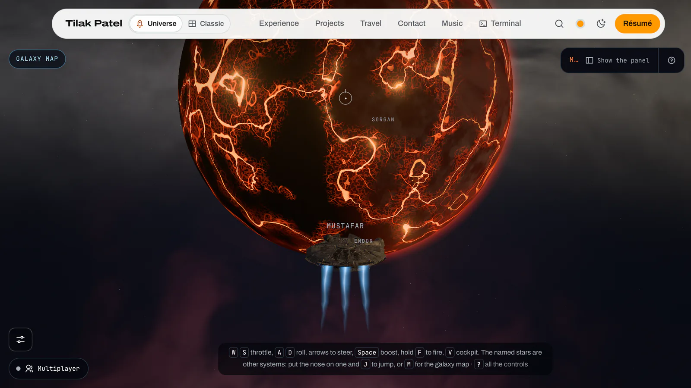</a>

Star Wars on the map isn't a planet but a universe of its own: the galaxy itself in miniature, a spiral of stars with its systems lit where they are, behind a hyperspace gate the Empire's Star Destroyers guard. Fly into the gate (or pick it and go) and you jump to lightspeed into `/galaxy`: eighteen star systems from the films (and from the two shows set after them, The Mandalorian and Ahsoka), from Tatooine, Hoth and Endor to Coruscant, Scarif, Nevarro and Mandalore, each with its region and grid square from the films' atlas, its era and films, and the moment it's remembered for playing out round it (Death Squadron over Hoth, the Battle of Endor, the Death Star rounding Yavin with its trench to fly, the Razor Crest with a TIE on its tail over Nevarro, the Mandalorians taking back Mandalore). Every pilot online sees the same moment at the same time, and meets the other pilots in the same system.

<table>
<tr>
<td width="33%" valign="top"><a href="https://tilakpatell.com/galaxy/hoth">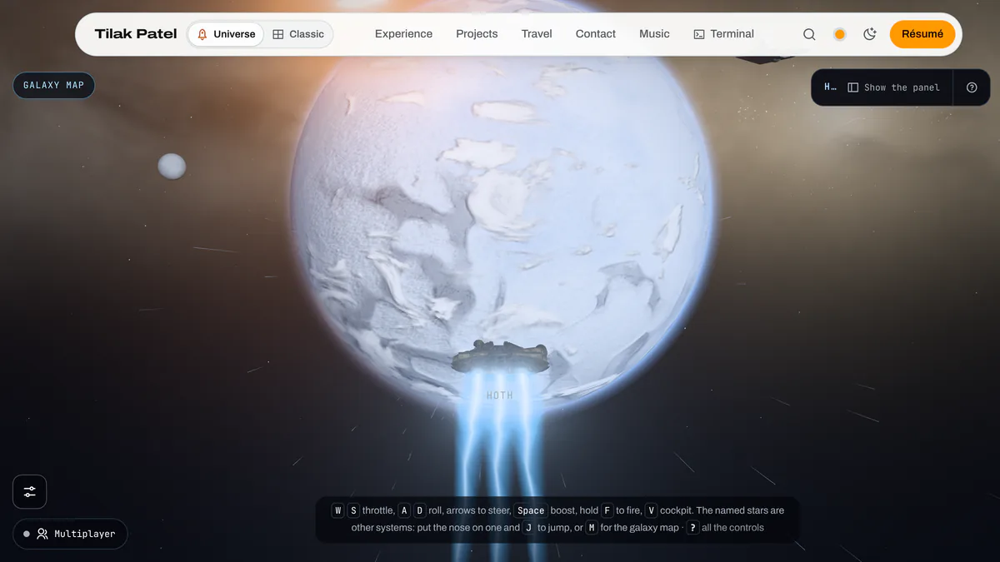</a><p><b>Hoth</b>, where Death Squadron waits</p></td>
<td width="33%" valign="top"><a href="https://tilakpatell.com/galaxy/endor">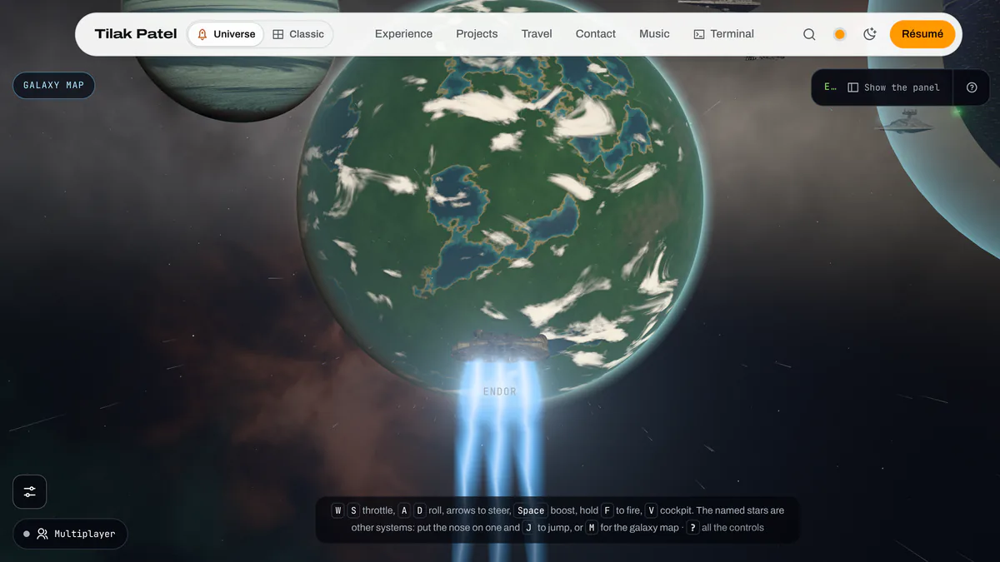</a><p><b>Endor</b>, and the Battle of Endor round it</p></td>
<td width="33%" valign="top"><a href="https://tilakpatell.com/galaxy/coruscant">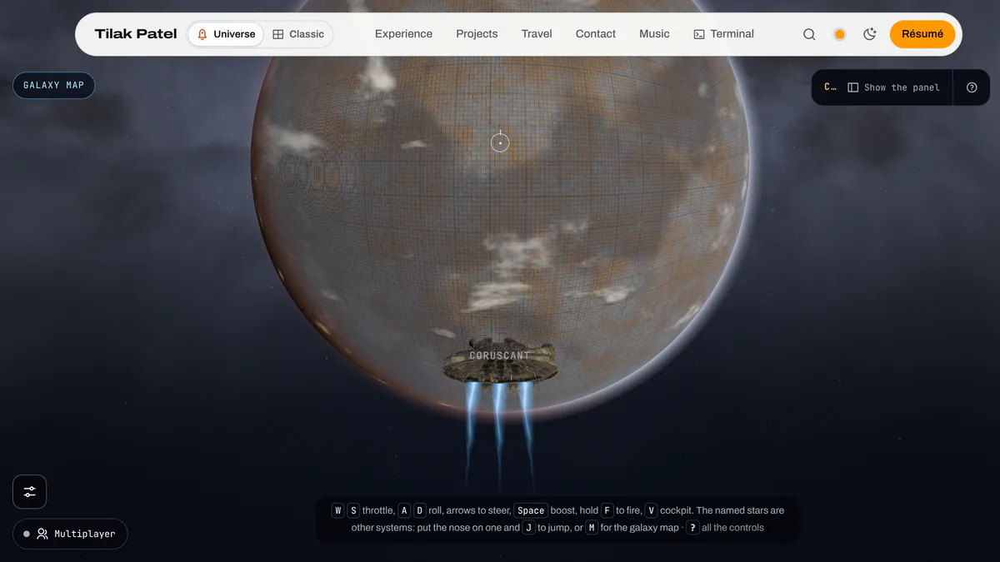</a><p><b>Coruscant</b>, a city from pole to pole</p></td>
</tr>
<tr>
<td width="33%" valign="top"><a href="https://tilakpatell.com/galaxy/scarif">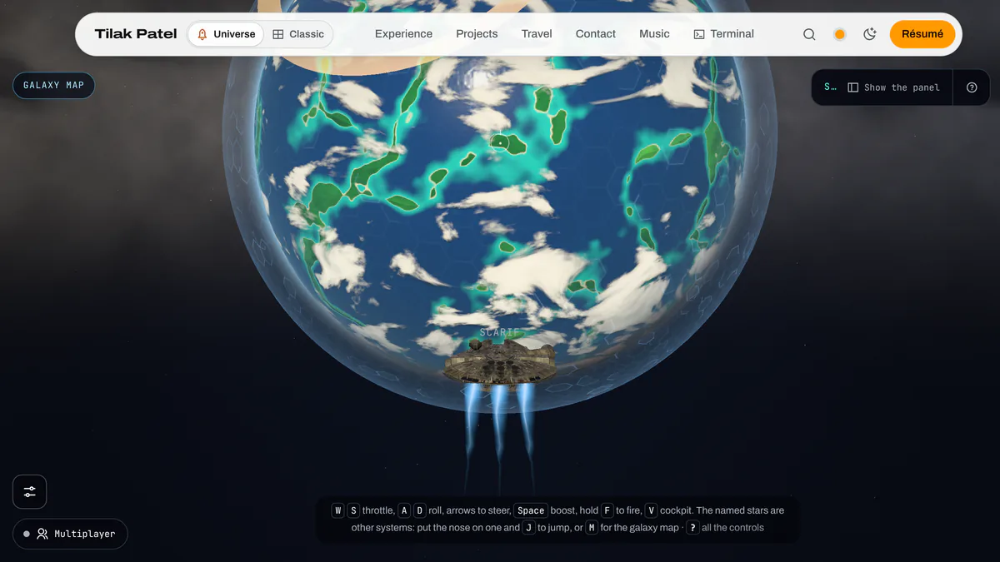</a><p><b>Scarif</b>, under the Empire's shield gate</p></td>
<td width="33%" valign="top"><a href="https://tilakpatell.com/galaxy/tatooine">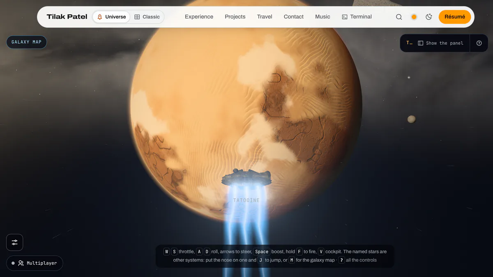</a><p><b>Tatooine</b>, two suns, and sand to the edge of the world</p></td>
<td width="33%" valign="top"><a href="https://tilakpatell.com/galaxy">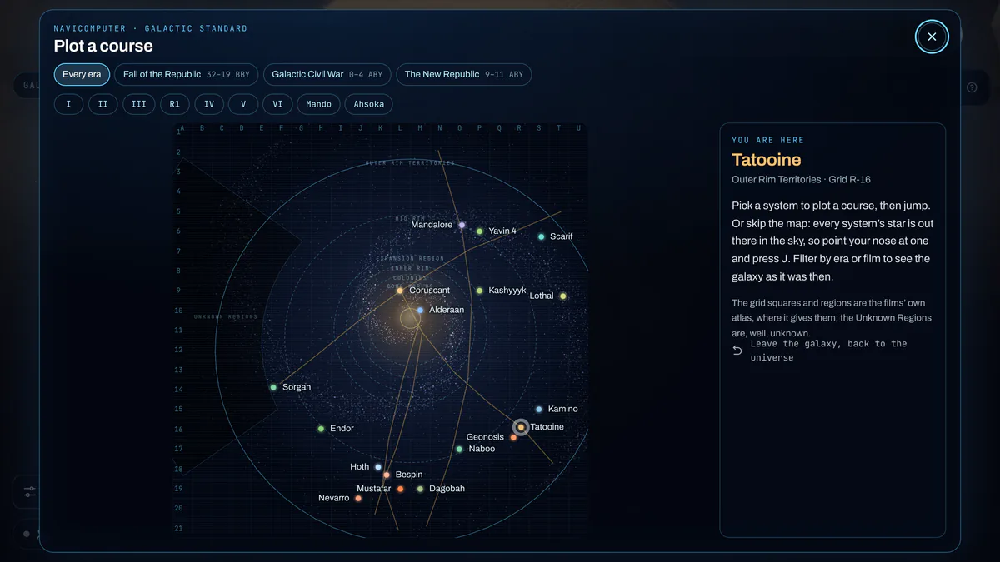</a><p><b>The galaxy map</b>, (<code>M</code>): plot a course, filter by era or film</p></td>
</tr>
</table>

Every other system's star is up there in the sky, where it really is from where you are (Hoth's close by from Bespin, high above the galaxy's band; Coruscant's a bright star toward the core). Turn the nose toward one and its name comes up; put the nose on it and press `J` (or tap Jump), or just fly on out of the system toward it, and you jump.

Keep jumping and the Empire notices. Somewhere between your tenth and fifteenth jump an Imperial Interdictor cruiser is waiting on the lane: its gravity-well projectors pull you out of hyperspace a long way short of where you were going, its TIEs launch, and the hyperdrive won't take again (nor the sublight drive open up) until you're clear of the well: shoot its fighters down, run for the well's edge, or ride it out. Then it jumps away, and the count starts over.

| Key | Action |
| --- | --- |
| `J` | Jump to lightspeed, to the star your nose is on (every ten to fifteen jumps, an Interdictor pulls you out short) |
| `M` | The galaxy map: plot a course, filter by era or film |
| `E` | Land on the planet you're at (or board the Death Star) |

### Down on the worlds

Every planet from the films you can stand on (all but Alderaan, which is gone) is a world of its own to land on and walk: `/galaxy/tatooine/surface`. Your ship comes down out of the sky and sets down, and you and your crewmate climb out onto the sand, the snow, the forest floor, a platform over Bespin's clouds or a Coruscant rooftop. Each world has the places from the films to find (the Lars homestead, Mos Eisley and the Sarlacc on Tatooine; Echo Base on Hoth; the Ewok village and the shield-generator bunker on Endor…), named on a compass until you've found them, with what the crew have to say about each; its people and creatures going about their business, who'll talk if you go up to them; speeders, speeder bikes and tauntauns to ride; walkers, ships going over, the weather and the sound of the place. Online, the other pilots down on the same world are there with you. Get back in the ship to take off, back up to the system.

<table>
<tr>
<td width="33%" valign="top"><a href="https://tilakpatell.com/galaxy/tatooine/surface">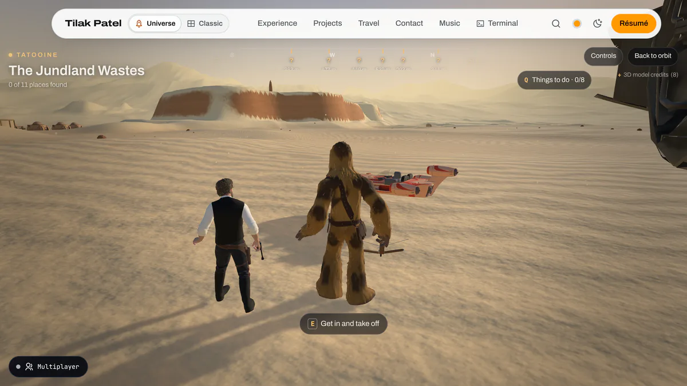</a><p><b>Tatooine</b>: the Jundland Wastes: the Lars homestead, Mos Eisley, the Sarlacc</p></td>
<td width="33%" valign="top"><a href="https://tilakpatell.com/galaxy/hoth/surface">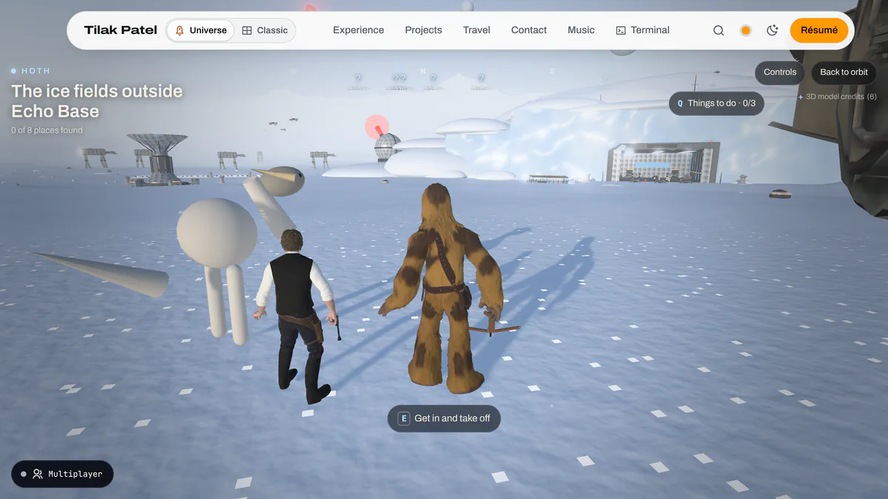</a><p><b>Hoth</b>: the ice fields outside Echo Base, walkers on the horizon</p></td>
<td width="33%" valign="top"><a href="https://tilakpatell.com/galaxy/endor/surface">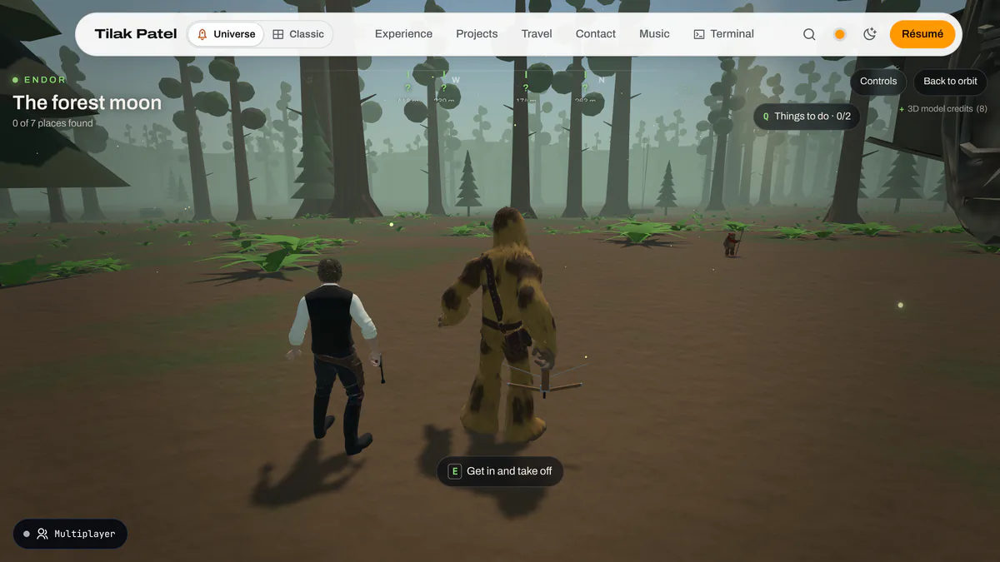</a><p><b>Endor</b>: the forest moon: the Ewok village and the shield-generator bunker</p></td>
</tr>
<tr>
<td width="33%" valign="top"><a href="https://tilakpatell.com/galaxy/bespin/surface">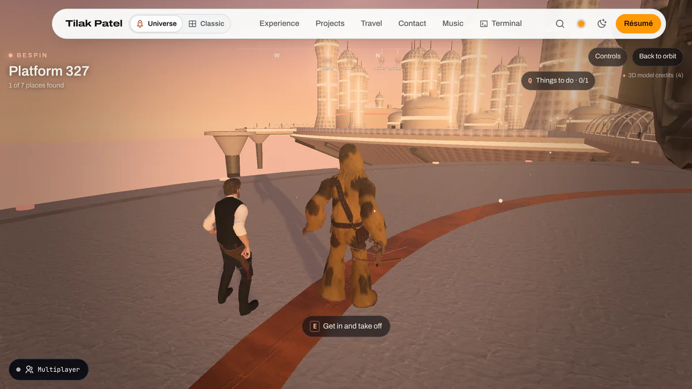</a><p><b>Bespin</b>: Platform 327, over Cloud City</p></td>
<td width="33%" valign="top"><a href="https://tilakpatell.com/galaxy/naboo/surface">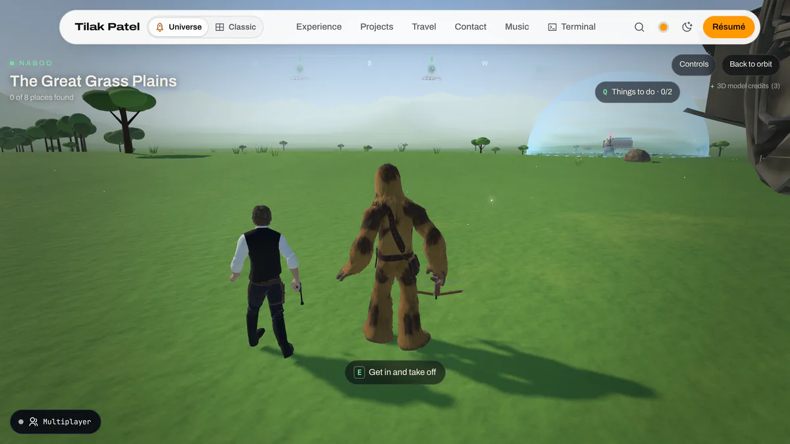</a><p><b>Naboo</b>: the Great Grass Plains</p></td>
<td width="33%" valign="top"><a href="https://tilakpatell.com/galaxy/mustafar/surface">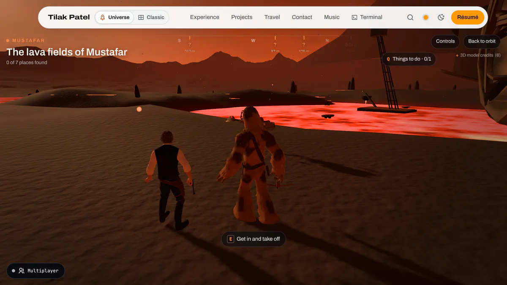</a><p><b>Mustafar</b>: the lava fields</p></td>
</tr>
</table>

| Key | Action |
| --- | --- |
| `W` `A` `S` `D` | Walk (the way the camera faces); on a speeder, throttle and steer |
| `Shift` / `Space` | Run (or boost) / jump |
| Drag, scroll | Look round, zoom |
| `E` | Talk, ride (and get off), get in the ship and take off |
| `Tab` | Swap to your crewmate |

The flying keys are the universe map's. Every system has a mission: the trench run, boarding the Death Star and Endor's speeder bike chase (four scout troopers racing through the redwoods for the bunker; shoot them off their bikes or shove them into a tree before one gets there) and Lothal's star map (race Sabine's speeder bike between the rock spires to the old Imperial tower, open the map, then hold the tower against Shin Hati and her mercenaries) and Dagobah's *Do or Do Not* (run the swamp with Yoda on your back, face what's in the cave, then raise the X-wing out of the bog) are playable now; the rest have briefings, with their own opening crawls, for games still being built ([the plan](docs/superpowers/specs/2026-10-05-galaxy-games-design.md)).

## The hidden worlds

Each planet on the map that has a world gets a page of its own, with its own art direction, soundboard and usually a game.

<table>
<tr>
<td width="50%" valign="top"><a href="https://tilakpatell.com/middle-earth">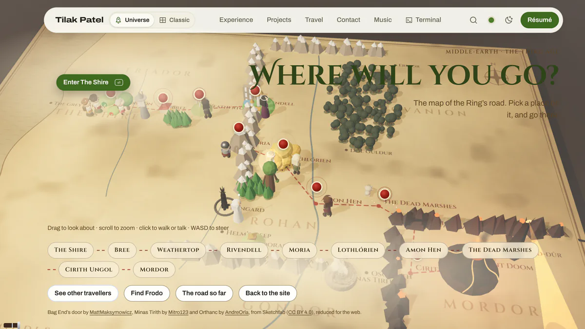</a><p><b>Middle-earth</b> · <sub>The Lord of the Rings</sub><br>A tabletop map of the Ring's road. Pick a stop, then walk it in 3D as Frodo, from Hobbiton to Mount Doom. <a href="https://tilakpatell.com/middle-earth">Go →</a></p></td>
<td width="50%" valign="top"><a href="https://tilakpatell.com/middle-earth/shire">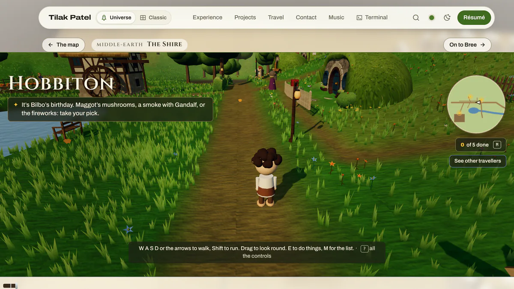</a><p><b>The Shire</b> · <sub>The Lord of the Rings</sub><br>Hobbiton on Bilbo's birthday: Maggot's mushrooms, a smoke with Gandalf, the fireworks, and a co-op kitchen at every stop. <a href="https://tilakpatell.com/middle-earth/shire">Go →</a></p></td>
</tr>
<tr>
<td width="50%" valign="top"><a href="https://tilakpatell.com/cybertron">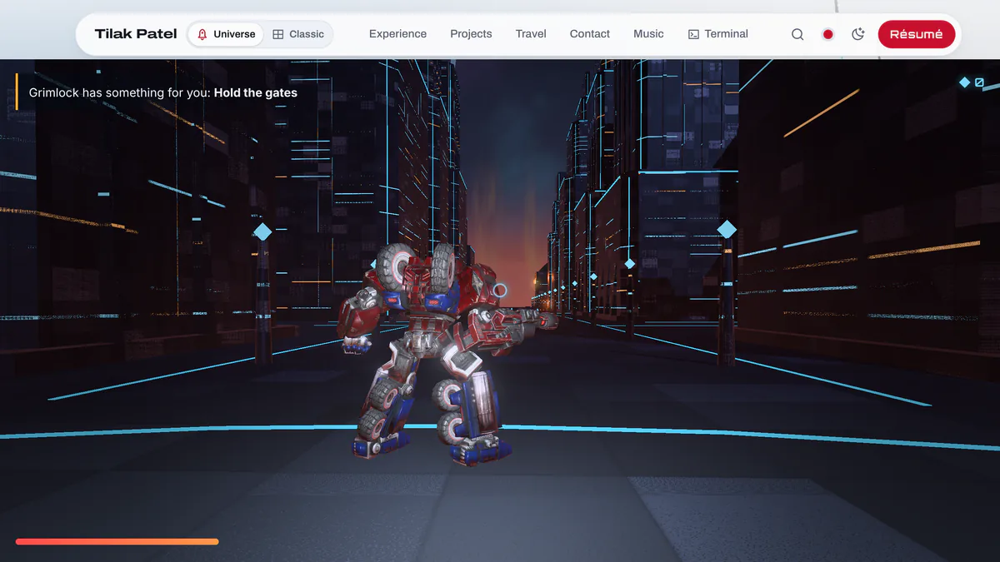</a><p><b>Cybertron</b> · <sub>Transformers</sub><br>Iacon at war, as War for Cybertron's Optimus. Transform into his truck any time, hold the gates with Grimlock, wake Metroplex. <a href="https://tilakpatell.com/cybertron">Go →</a></p></td>
<td width="50%" valign="top"><a href="https://tilakpatell.com/avengers">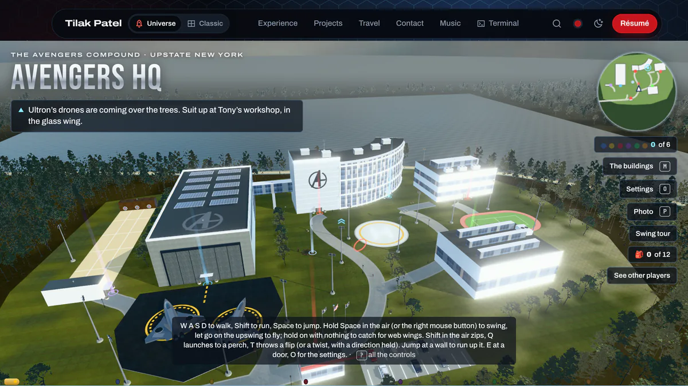</a><p><b>Avengers HQ</b> · <sub>Marvel</sub><br>Swing across the compound as Spider-Man, fly the Iron Man armour, and win the Infinity Stones back from Thanos. <a href="https://tilakpatell.com/avengers">Go →</a></p></td>
</tr>
<tr>
<td width="50%" valign="top"><a href="https://tilakpatell.com/albuquerque">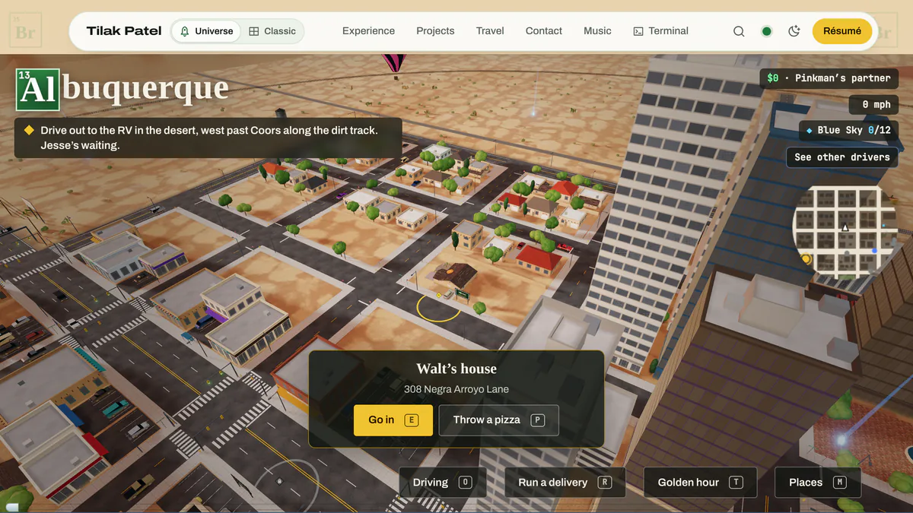</a><p><b>Albuquerque</b> · <sub>Breaking Bad</sub><br>Walt's Aztek, a handbrake that drifts, and a town that opens up as his career grows. <a href="https://tilakpatell.com/albuquerque">Go →</a></p></td>
<td width="50%" valign="top"><a href="https://tilakpatell.com/scranton">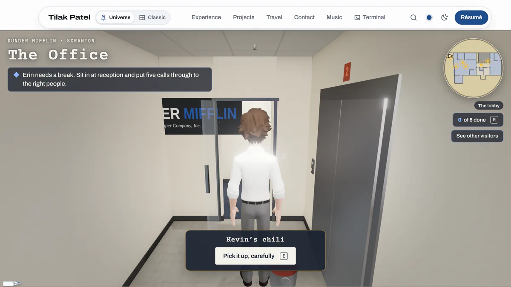</a><p><b>Scranton</b> · <sub>The Office</sub><br>A week at Dunder Mifflin as Jim, in seven jobs: the stapler in Jell-O, Kevin's chili, Dwight's fire drill. <a href="https://tilakpatell.com/scranton">Go →</a></p></td>
</tr>
<tr>
<td width="50%" valign="top"><a href="https://tilakpatell.com/c-137">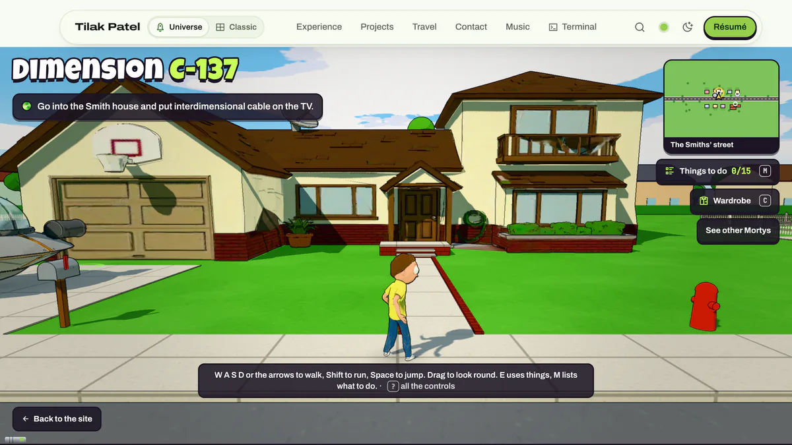</a><p><b>Dimension C-137</b> · <sub>Rick and Morty</sub><br>The Smiths' street as Morty: the garage portal, Blips and Chitz, a wardrobe, and Rick's cruiser to fly. <a href="https://tilakpatell.com/c-137">Go →</a></p></td>
<td width="50%" valign="top"><a href="https://tilakpatell.com/c-137/citadel">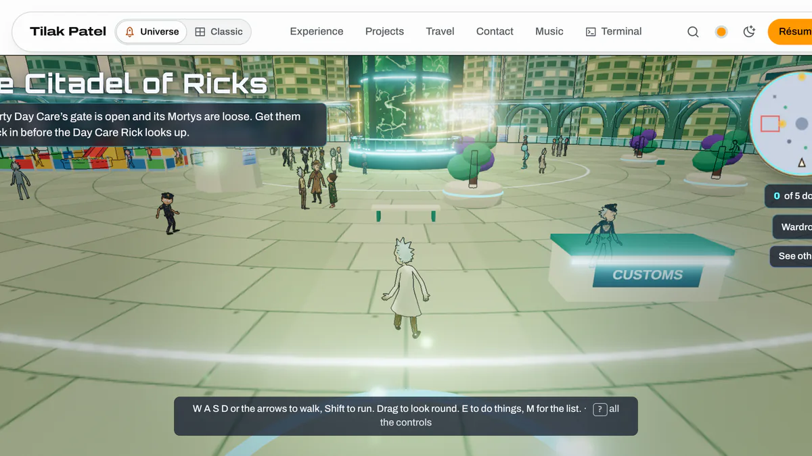</a><p><b>The Citadel of Ricks</b> · <sub>Rick and Morty</sub><br>Walk the concourse as Rick C-137, among every Rick and Morty there is: Morty Day Care, the Council, the red alert. <a href="https://tilakpatell.com/c-137/citadel">Go →</a></p></td>
</tr>
<tr>
<td width="50%" valign="top"><a href="https://tilakpatell.com/earth">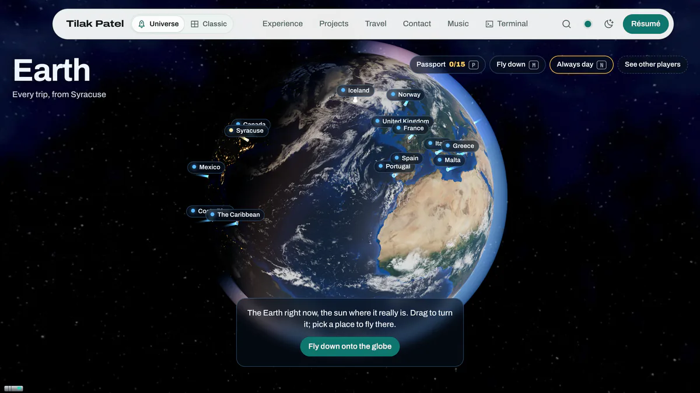</a><p><b>Earth</b> · <sub>Travel</sub><br>The real globe as it is right now, and a little plane to fly to every place I've been, stamping a passport. <a href="https://tilakpatell.com/earth">Go →</a></p></td>
<td width="50%" valign="top"><a href="https://tilakpatell.com/dot-matrix">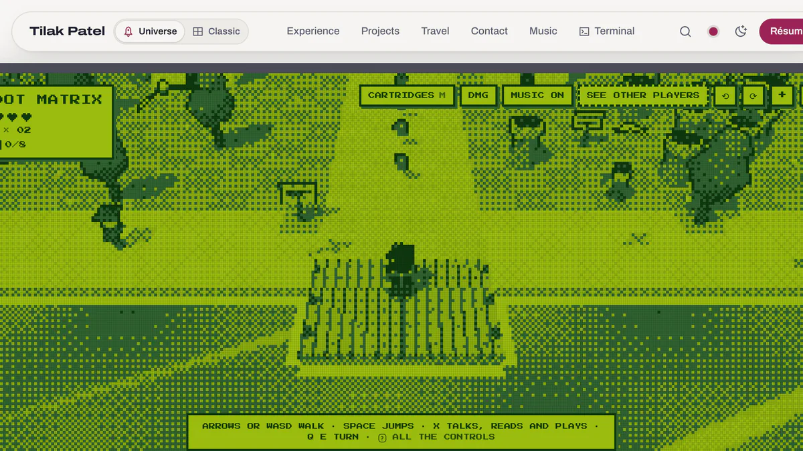</a><p><b>Dot Matrix</b> · <sub>Gaming</sub><br>A Game Boy island in its four greens: eight cartridges to find, one per project, and a giant Game Boy to play. <a href="https://tilakpatell.com/dot-matrix">Go →</a></p></td>
</tr>
<tr>
<td width="50%" valign="top"><a href="https://tilakpatell.com/music">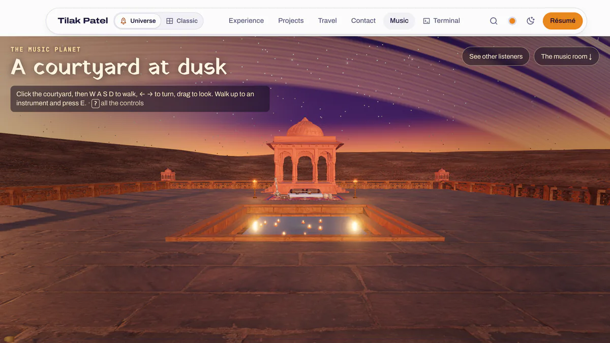</a><p><b>The music room</b> · <sub>Indian classical music</sub><br>A sandstone courtyard at dusk: a sitar, a harmonium, the tabla and the tanpura, and forty ragas to play. <a href="https://tilakpatell.com/music">Go →</a></p></td>
<td width="50%" valign="top"><a href="https://tilakpatell.com/invincible">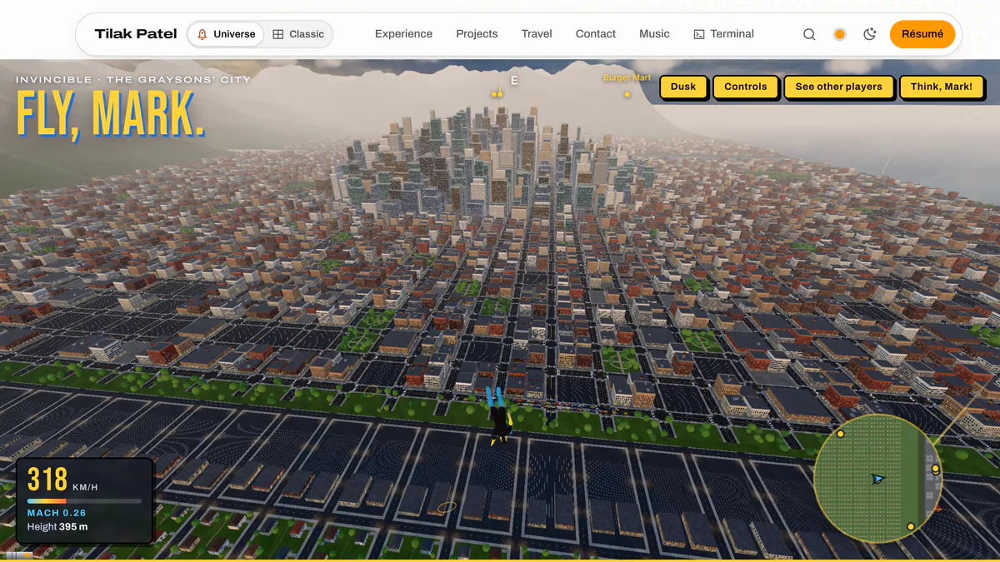</a><p><b>Invincible</b> · <sub>Invincible</sub><br>Fly the Graysons' whole city as Mark, through the sound barrier, into the ground, and up to the Moon and Mars. <a href="https://tilakpatell.com/invincible">Go →</a></p></td>
</tr>
<tr>
<td width="50%" valign="top"><a href="https://tilakpatell.com/caribbean">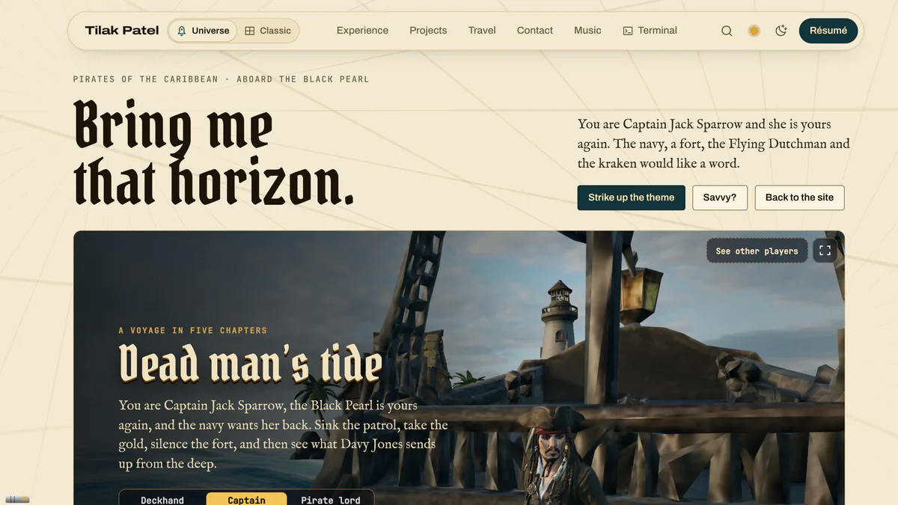</a><p><b>The Caribbean</b> · <sub>Pirates of the Caribbean</sub><br><i>Dead Man's Tide</i>, at the Black Pearl's helm: sink the patrol, take the gold, silence the fort, then meet Davy Jones. <a href="https://tilakpatell.com/caribbean">Go →</a></p></td>
<td width="50%" valign="top"><a href="https://tilakpatell.com/deathstar">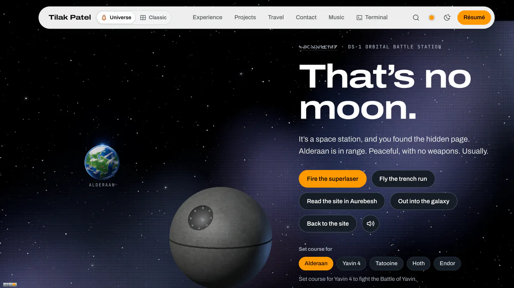</a><p><b>The Death Star</b> · <sub>Star Wars</sub><br>That's no moon. Fire the superlaser, or fly the trench run before Yavin 4 comes into range. <a href="https://tilakpatell.com/deathstar">Go →</a></p></td>
</tr>
</table>

<details>
<summary><b>Everything in each world</b></summary>

| World | Route | Fandom | Highlights |
| --- | --- | --- | --- |
| A galaxy far, far away | [`/galaxy`](https://tilakpatell.com/galaxy) | Star Wars | Eighteen star systems to fly, jump between and fight over, each with a mission briefing, and the films' worlds to land on and walk |
| Death Star | [`/deathstar`](https://tilakpatell.com/deathstar) | Star Wars | Fly the trench run before Yavin 4 comes into range |
| Music room | [`/music`](https://tilakpatell.com/music) | Indian classical music | Land on the music planet and walk a dusk courtyard in 3D to its instruments; a sitar with fret settings and an auto chikari, a real harmonium, the tabla and the tanpura; forty ragas, or your own. Everyone else online in the courtyard is a lamp floating where they stand, with their name over it |
| Middle-earth | [`/middle-earth`](https://tilakpatell.com/middle-earth) | The Lord of the Rings | A map of chapters: walk every stop on the road in 3D as Frodo, from Hobbiton to Mount Doom, each with a game on the side (Bilbo's spoons, a song on the Pony's table, Gandalf's mark, riddles with Bilbo, the plank over the well, Legolas's targets, ducks and drakes, Sméagol's safe way, crumbs on Sam's cloak, remembering the Shire); cook in co-op, Overcooked-style, in a kitchen at each one (Bilbo's party, the Prancing Pony, Weathertop, Elrond's table, the forges of Moria, Lórien's flets, Parth Galen, Ithilien, the orcs' mess in Cirith Ungol and the feast at Cormallen); open the Doors of Durin, cross Gorgoroth; find Orthanc off the road; and read the road so far on the map (seals, side stars, kitchen stars) |
| Cybertron | [`/cybertron`](https://tilakpatell.com/cybertron) | Transformers | Walk, drive and fight through Iacon at war as War for Cybertron's Optimus, in the Aligned continuity's own models (High Moon's games and *Prime*): transform into his truck any time on the ground (`Q`), hold the gates with Grimlock, run energon for Bumblebee, drive Jetfire's beacons to wake Metroplex, then defend the space-bridge pad from Megatron, who turns into his tank and charges, and take the Matrix of Leadership back from Shockwave in the Hall of Records. Barricade turns into his car and rams; Metroplex wakes on the skyline once you've woken him. Through the bridge are Team Prime's base (report to Ratchet, Bulkhead, Arcee and Bumblebee) and, through the ground bridge, the desert outside Jasper (clear the Decepticons' energon mine, find Arcee's Iacon relic). Mouse and keys, a gamepad, or touch sticks on a phone, where the world takes the whole screen. Below it: pick a side, write in Cybertronian, play *Roll out* |
| Avengers HQ | [`/avengers`](https://tilakpatell.com/avengers) | Marvel | Walk the compound in 3D as Spider-Man, or swing across it the way Insomniac's games do: hold the jump in the air to web a roof edge, a tree or a floodlight mast, steer the swing, let go on the upswing for a perfect release, zip with Shift, throw flips and twists in the air with `T` for style points that bank when you land (and are lost if you land mid-flip), run up any wall you hit and along the roofs, race the swing tour's rings round the compound (against a hologram of your best lap, once you have one), suit up in the Iron Man armour by Tony's workshop door (`E`) and fly it on its repulsors, stop time with `P` for a photo (the camera anywhere round him, a lens and a picture to save), and find the twelve backpacks Peter webbed up round it (on the roofs, up the masts, under the bridge), each with something of his in it. Everyone else online shows as a hologram. Each building opens its game (*Thwip!* at the front gate), and each game wins an Infinity Stone back for Thanos's gauntlet |
| Albuquerque | [`/albuquerque`](https://tilakpatell.com/albuquerque) | Breaking Bad | Drive around town in Walt's Aztek, which slides if you ask it to: `Space` is the handbrake (handbrake turns, drifts, a J-turn out of reverse), and `O` opens the driving settings (steering, stability, camera). Places open up as Walt's career grows, each with its own game. Other drivers online show up as ghost Azteks |
| Scranton | [`/scranton`](https://tilakpatell.com/scranton) | The Office | Walk Dunder Mifflin in 3D as Jim, from the lift to the annex, and get through a week in seven jobs (cover reception, the stapler in Jell-O, Kevin's chili, paper toss, Dwight's fact check, his fire drill, a Dundie from Michael); then the office from above, Dwight's fact check and the Dundies. Everyone else online walks the office as a pale Jim from another branch, with their name over him |
| Dimension C-137 | [`/c-137`](https://tilakpatell.com/c-137) | Rick and Morty | Walk the Smiths' street in 3D as Morty, fly Rick's cruiser (it talks, and the Federation's patrol ship flies alongside), meet the President at his limo and take his portal to the Oval Office, breakfast with a Federation agent at Shoney's, find Rick's clone lab under the garage and Morty's Mind Blowers past it, go through the garage portal to Blips and Chitz and play *Roy*; the portal gun, *Portal panic*, the Meeseeks box and interdimensional cable; the wardrobe (C, or its button), to dress Morty and Rick as you like: Rick C-137, Tiny Rick or a Citadel Rick, Evil or Cop Morty, their coats, shirts, trousers and hair in the show's colours, a hat, shades or goggles, and the portal gun in hand, worn wherever they turn up (the street, the Citadel, the cruiser's seats, out of the ship on a planet) and seen online; and the Citadel of Ricks (`/c-137/citadel`, or fly into it on the map), walked in 3D as Rick C-137: a terrace over the show's city of Ricks, crowds of every Rick and Morty variant, a core of portal fluid with the Central Finite Curve turning round it, and five scenes from the show (Morty Day Care, Simple Rick's line, the Council, election day, the red alert). Everyone else online walks the street as a Morty from another dimension, and the Citadel as a Rick |
| Earth | [`/earth`](https://tilakpatell.com/earth) | Travel | Down from orbit onto the globe as it is right now (NASA's Blue Marble and Black Marble, the real sun), then fly a little plane to every place I've been: a passport stamp and a postcard at each. Fly it from the chase camera or the cockpit (`V`), drag to look round it, get down under the cloud deck or up to the edge of space, barrel roll with `R`, and let the autopilot take it (it slows down to turn). A flight log keeps the trail flown and draws the route home to every place stamped; the distance adds up over every visit, and once round the world is an achievement. Everyone else online flying the Earth shows as a pale plane with their name |
| Dot Matrix | [`/dot-matrix`](https://tilakpatell.com/dot-matrix) | Gaming | A Game Boy island in its four greens (a Bayer-dithered last pass, outlines from the depth buffer): jump about, find the eight cartridges (each one a project) and play the giant Game Boy in the square, or the giant N64 beside it, which plays the Super Mario 64 tribute below. Four villagers walk their beats and stop to talk, each with a hint to a cartridge; every fifteen coins give a heart back, and the last coin is an achievement; a lighthouse sweeps the islet and a windmill turns on the plateau; the wheel, a pinch or `+` `−` zoom the camera. Everyone else online on the island walks about as a ghost with their name over them. The page has the island's map, with the cartridges marked as they're found |
| Super Mario 64 | [`/dot-matrix/64`](https://tilakpatell.com/dot-matrix/64) | Super Mario | A fan tribute to the N64 game, from the giant N64 on Dot Matrix island or its own page: Peach's castle grounds and its inside to run about, with paintings that are the ways into its worlds, and star doors that open as Power Stars are found. Mario moves the way he did on the N64 (the triple jump, the backflip and side flip, the long jump, wall kicks, the dive, the ground pound, crouch slides, ledge grabs, swimming, picking things up and throwing them), with the three-distance camera behind him. Bob-omb Ridge is the first world: King Bob-omb on the summit, eight red coins, and the Chain Chomp to free, three stars of fifteen. Physically based CC0 textures, image-based light, soft shadows and bloom; Mario and the cast are made in code, and the music is original and synthesised. Saves the stars, the lives and the look |
| The Caribbean | [`/caribbean`](https://tilakpatell.com/caribbean) | Pirates of the Caribbean | Sail *Dead Man's Tide* at the Black Pearl's helm |
| Invincible | [`/invincible`](https://tilakpatell.com/invincible) | Invincible | Fly the Graysons' whole city in 3D as Mark: six kilometres of downtown, river, suburbs and coast, through the sound barrier, into the ground hard enough to crack it, and up out of the air into space, to the Moon and Mars. Dad's rings, eight hidden title cards, rescues, traffic and people, Atom Eve on patrol, Allen and Thragg out in space; then *Think, Mark!* below it, with HD figures |

</details>

## Easter eggs

- **↑ ↑ ↓ ↓ ← → ← → B A** jumps to lightspeed.
- **⌘K / Ctrl+K** opens a command palette that can go anywhere on the site and run its tricks.
- There are dozens of achievements to unlock. Scranton's Dundies hand them out as awards.
- The fan colour schemes the eggs unlock each bring a live background to the portfolio pages: a dogfight crossing the stars for the Jedi and the Sith, Heisenberg's blue crystals, Iron Man's HUD tracking the pointer, Dunder Mifflin's paper and paper airplanes, invaders marching over a synthwave grid, diyas and sky lanterns, a ship on the horizon at Tortuga, Cybertron's energon and insignia, the Shire's fireworks or the Eye of Sauron watching you, and portals. Click on empty page for a surprise. The company schemes get quieter ones drawn from the work (AWS's racks and smile, RTX's engineering drawing, Bose's sound, Pendar's spectra, Empowerreg's knowledge graph, SRC's radar), and each project's page gets one of its own (the Game Boy's dot matrix, Claude's spark, DevSpace's minimap, GitHub's contribution graph, the shell's prompt, FUSE's file tree, the finance platform's candles, PyTorch's network, a GPU die). Either can be switched off under the colour picker.

## Credits

This site stands on a lot of other people's work, and I'm grateful for all of it. **[CREDITS.md](CREDITS.md) lists every one**: <!-- counts:start -->178 3D models by 109 artists, 136 free scans, skies and kit pieces, 61 photos and 12 open fonts<!-- counts:end -->, each with its author, licence and where it's used. Each is credited on the page that uses it too.

**Thank you to the 3D artists** whose Sketchfab models fly, walk and stand about in the worlds:

<!-- artists:start -->
[A308 Digital](https://sketchfab.com/A308) · [abhi_soni14](https://sketchfab.com/abhisheksoni14) · [aclarke064](https://sketchfab.com/aclarke064) · [Alana G](https://sketchfab.com/alanaguidry05) · [Amagi_Arts](https://sketchfab.com/natsuboy304) · [AndreOrla](https://sketchfab.com/andreorla) · [Ara_my45yt](https://sketchfab.com/Ara_my45yt) · [ARKON MAREK](https://sketchfab.com/ARKON-83) · [art16c](https://sketchfab.com/art16c) · [BaptisteBerard](https://sketchfab.com/BaptisteBerard) · [Batuhan13](https://sketchfab.com/Batuhan13) · [Bhavlin](https://sketchfab.com/thakurbhavmanyu5) · [biggreenorange](https://sketchfab.com/biggreenorange) · [Blender user Srikanth M](https://sketchfab.com/Ani-sri) · [Bob.Ho](https://sketchfab.com/Bob.Ho) · [CGI Tutorials](https://sketchfab.com/cgitutorials) · [CHANG747](https://sketchfab.com/CHANGP453) · [charles.woods](https://sketchfab.com/charles.woods) · [Cristianolop](https://sketchfab.com/Cristianolop) · [dandruffkielbasa](https://sketchfab.com/dandruffkielbasa) · [Daniel](https://sketchfab.com/DanielAndersson) · [dioiiiii2](https://sketchfab.com/dioiiiii2) · [dmitriev_nd](https://sketchfab.com/dmitriev_nd) · [doclusifer2](https://sketchfab.com/doclusifer2) · [DrEgguin](https://sketchfab.com/DrEgguin) · [enzinogenie](https://sketchfab.com/enzinogenie) · [Er.B.Nijithkumar](https://sketchfab.com/nijithkumar99) · [evolveduk](https://sketchfab.com/evolveduk) · [fhfhhf](https://sketchfab.com/fhfhhf) · [Francesco Coldesina](https://sketchfab.com/topfrank2013) · [fredbear1211](https://sketchfab.com/fredbear1211) · [Gojiram](https://sketchfab.com/geoffscool) · [Graph VFX](https://sketchfab.com/GraphVFX) · [hafid.quispe](https://sketchfab.com/hafid.quispe) · [HarrisonHag1](https://sketchfab.com/HarrisonHag1) · [HarukaS](https://sketchfab.com/Haruka_S) · [haykal12321](https://sketchfab.com/haykal12321) · [hobbit84](https://sketchfab.com/hobbit84) · [horuschild](https://sketchfab.com/horuschild) · [Ian Sayers](https://sketchfab.com/ians) · [jay2307](https://sketchfab.com/jay2307) · [jerrylxia](https://sketchfab.com/jerrylxia) · [Josuez5](https://sketchfab.com/Josuez5) · [juancadriveros09](https://sketchfab.com/juancadriveros09) · [judpro](https://sketchfab.com/judpro) · [Just Ryk](https://sketchfab.com/dryk4085) · [King_45](https://sketchfab.com/King_45) · [Kmirp99](https://sketchfab.com/Kmirp99) · [kobaltsecond6c7d6150917a4267](https://sketchfab.com/kobaltsecond6c7d6150917a4267) · [Kuat-Entralla 3D Engineering](https://sketchfab.com/KuatEntralla3D) · [laboratorija](https://sketchfab.com/laboratorija) · [LarsH.](https://sketchfab.com/LarsH.) · [lolqeeeeeeeeee](https://sketchfab.com/lolqeeeeeeeeee) · [Lora_o](https://sketchfab.com/Lora_o) · [LostBoyz2078](https://sketchfab.com/LostModels2025) · [lucq22](https://sketchfab.com/lucq22) · [malin.sandred](https://sketchfab.com/malin.sandred) · [masoudnayab](https://sketchfab.com/masoudnayab) · [MattMaksymowicz](https://sketchfab.com/mattmaksymowicz) · [michael50](https://sketchfab.com/michael50) · [Mind Mulch for The Masses](https://sketchfab.com/mindmulchforthemasses) · [mister dude](https://sketchfab.com/misterdude) · [Mitro123](https://sketchfab.com/Mitro123) · [mpolo0604](https://sketchfab.com/mpolo0604) · [NexusSpeedster](https://sketchfab.com/nexusfnf) · [Nodeaxis Interactive](https://sketchfab.com/ar.jethin) · [OrangeSauceu](https://sketchfab.com/orangesauceu) · [Owen Cornelius](https://sketchfab.com/omcstudios333) · [PCIXOPAT](https://sketchfab.com/PCIXOPAT) · [photon (that one larry)](https://sketchfab.com/Professor_E12) · [Pipogame](https://sketchfab.com/joseclaudio162001) · [PlantCatalog](https://sketchfab.com/PlantCatalog) · [PRIZMA](https://sketchfab.com/PRIZMA) · [Quiznos323](https://sketchfab.com/quiznos323) · [rajoelinirinanear](https://sketchfab.com/rajoelinirinanear) · [RC-KOA](https://sketchfab.com/RC-Koa) · [rSquare](https://sketchfab.com/rSquare) · [rubaun](https://sketchfab.com/rubaun) · [scarlequin](https://sketchfab.com/scarlequin) · [Scorpion4241](https://sketchfab.com/Scorpion4241) · [shamus](https://sketchfab.com/consistent_models) · [sinuboy072](https://sketchfab.com/sinuboy072) · [smithson17](https://sketchfab.com/smithson17) · [Sofyan Kurniawan](https://sketchfab.com/sofyankurniawan) · [S🅾️Meme star wars](https://sketchfab.com/dylantrooper7) · [StrangeUsernames1](https://sketchfab.com/StrangeUsernames1) · [Stym](https://sketchfab.com/Stym) · [SusanKing](https://sketchfab.com/krolzuzannapl) · [Suvalien](https://sketchfab.com/Suvalien) · [svemun](https://sketchfab.com/svemun) · [Swimknot19](https://sketchfab.com/RafaMario) · [Tami_Taoli](https://sketchfab.com/Taminatorhator) · [tegnemaskin](https://sketchfab.com/tegnemaskin) · [Telkar5](https://sketchfab.com/Telkar5) · [temp0.crazy](https://sketchfab.com/temp0.crazy) · [ThisIsntAPerson](https://sketchfab.com/ThisIsntAPerson) · [ThrillDaWill](https://sketchfab.com/ThrillDaWill) · [toro ardido modelos 3d](https://sketchfab.com/toro_ardido_modelos_3d) · [turbopurr](https://sketchfab.com/turbopurr) · [tutan09](https://sketchfab.com/tutan09) · [Ulrik S. Selvik](https://sketchfab.com/Nemi66) · [Venkat Gurdge](https://sketchfab.com/venkatgurdge) · [VertexDon](https://sketchfab.com/Don42) · [VikoizBeast](https://sketchfab.com/VikoizBeast) · [w3ndy23](https://sketchfab.com/w3ndy23) · [WKAC](https://sketchfab.com/WKAC) · [yadrogames](https://sketchfab.com/yadrogames) · [Zack_Hawley](https://sketchfab.com/Zack_Hawley) · [Zorg_Sinister](https://sketchfab.com/4130ff15fe394c239cc064b5286c43)
<!-- artists:end -->

And to [Poly Haven](https://polyhaven.com) and [ambientCG](https://ambientcg.com) for their free scans and skies, [Kenney](https://kenney.nl) for the kits behind *Portal panic*, NASA Earth Observatory for the Blue Marble and Black Marble, Natural Earth, the photographers on Wikimedia Commons, the type designers behind every open font here, and the people who make [three.js](https://threejs.org).

**The light in the worlds is [Bruno Simon](https://bruno-simon.com)'s idea**, from his folio ([`brunosimon/folio-2019`](https://github.com/brunosimon/folio-2019), MIT): the light lives in textures, not in a shadow pass. As each world opens, it renders its floor's soft shadows and the sky's occlusion once, on the GPU, and warms the lower faces of everything with the ground's colour. Whatever moves stands on a soft blob slid away from the sun (`src/lib/three/groundwork.js`; the research is [`docs/research/2026-10-06-bruno-simon-folio.md`](docs/research/2026-10-06-bruno-simon-folio.md)).

> **Did you make something that's on this site, and I've missed you or got it wrong?** Message me at [tilakny@gmail.com](mailto:tilakny@gmail.com) or on [LinkedIn](https://www.linkedin.com/in/tilakpatell) and I'll add you straight away, or open a pull request. If you'd rather your work came down, say so and it will.

The characters and buildings in the worlds that aren't anyone else's were made for this site with [Meshy](https://www.meshy.ai), or modelled in code. CREDITS.md is made by `npm run credits` from the same lists the site reads, so it stays in step with them.

## Under the hood

### Tech stack

- **[React 19](https://react.dev/)** with [React Router 7](https://reactrouter.com/) (hash routing, so it works on static hosting)
- **[Vite 8](https://vitejs.dev/)** (Rolldown) for the dev server and build
- **[Tailwind CSS 3](https://tailwindcss.com/)** plus per-company and per-world themes
- **[Three.js](https://threejs.org/)** for every 3D scene and game, loaded only when needed
- **[Nostr](https://nostr.com/)** public relays for multiplayer, with events signed using [`@noble/secp256k1`](https://github.com/paulmillr/noble-secp256k1). There's no backend.
- **[Vitest](https://vitest.dev/)** for tests and **ESLint** for linting
- **GitHub Actions** and **GitHub Pages** for deploys

### Running it

You need **Node.js 22** (the version CI uses) and npm.

```bash
git clone https://github.com/tilakpatell/new-portfolio-website.git tilakpatell.com
cd tilakpatell.com
npm install
npm run dev
```

The site is then running at http://localhost:5173.

To try a lower graphics tier on a desktop, add `?quality=low` (or `mid` or `high`) to the address.

### Scripts

| Command | What it does |
| --- | --- |
| `npm run dev` | Start the Vite dev server |
| `npm run build` | Production build into `dist/`. Takes a fresh GitHub snapshot first (`prebuild`) |
| `npm run preview` | Serve the production build locally |
| `npm run lint` | Run ESLint |
| `npm test` | Run the Vitest suite (game rules, flight model, multiplayer protocol and more) |
| `npm run credits` | Rebuild [CREDITS.md](CREDITS.md) from the site's own credit lists |
| `node scripts/autopilot-check.mjs` | Everything the autopilot checks before a merge: lint, tests, build, bundle sizes, every page in headless Chromium |

The asset pipeline scripts regenerate committed files. You don't need them to run the site.

| Command | What it does |
| --- | --- |
| `npm run cc0` | Fetch the games' CC0 scans and skies from Poly Haven and ambientCG into `public/games/` (behind a proxy, set `NODE_USE_ENV_PROXY=1`) |
| `npm run hq-assets` | Fetch and shrink the Avengers HQ games' CC0 assets into `public/hq/` |
| `npm run kenney` | Convert Kenney's kits for *Portal panic* (`KENNEY=/path/to/kits npm run kenney`) |
| `npm run photos` | Turn the Travel photos into small WebP files and record their sizes, alt text and credits |
| `npm run globe` | Rebuild the dotted globe on the Travel page |
| `python3 scripts/build-harmonium.py` | Rebuild the music room's harmonium from its CC0 recording (downloads it the first time) |
| `node scripts/ktx2.mjs report <files>` | For each texture in the given GLBs or images: what it would cost and save as a GPU-compressed KTX2 (bytes, GPU memory, PSNR) and whether it's worth it. `convert` rewrites them; the site's loader reads KTX2 already |

The scripts that call Meshy (`scripts/meshy*.mjs`) read `MESHY_API_KEY` from `.env.local`; `scripts/meshy.mjs <step> hd` makes Rick and Morty again at about 40,000 faces and 2k textures from their own concept images. Sketchfab downloads are brought down to web size by `scripts/sketchfab-import.mjs` and `scripts/sketchfab-batch.mjs`; the wardrobe's portal gun by `scripts/sketchfab-gear.mjs`.

### Project structure

```
├── .github/workflows/ci.yml       # lint, test and build on every pull request
├── .github/workflows/deploy.yml   # lint, test, build and deploy on every push to main
├── CREDITS.md                     # everyone whose work is on the site (npm run credits)
├── docs/                          # architecture notes, research and design plans
│   ├── autopilot/                 # the self-improvement loop: its backlog and switches
│   └── readme/                    # the pictures in this README
├── public/                        # static files: models, textures, audio, photos, résumé PDF
│   ├── cc0/                       # CC0 materials and HDRIs (credited in its README)
│   ├── games/                     # game assets, credited in credits.json
│   └── models/                    # glTF models (Meshy-generated and Sketchfab)
├── scripts/                       # asset pipelines, the GitHub snapshot and the credits
└── src/
    ├── data/                      # the content: roles, projects, skills, education, places
    ├── pages/                     # one file per route
    ├── components/
    │   ├── universe/              # the universe map: flight, targeting, HUD
    │   │   └── online/            # multiplayer over Nostr
    │   ├── galaxy/                # a galaxy far, far away: the systems, hyperspace, the galaxy map
    │   │   └── surface/           # its worlds from the ground: land, terrain, sky, the places, people and rides
    │   ├── cockpit/               # the welcome, the crawl and the launch
    │   ├── worlds/                # world registry and the download gate for phones
    │   ├── games/                 # shared game code: GPU check, gamepad, sounds
    │   └── <world>/               # one folder per hidden world
    ├── runtime/                   # the world runtime: one renderer, loop, input, audio and save store
    ├── stages/                    # the live demos on project pages
    ├── lib/                       # device tiers, GPU detection, audio, textures
    │   └── three/                 # shared renderer, adaptive pacing, useScene hook
    └── theme/                     # company themes and the theme provider
```

### How it works

A few of the design decisions behind the site:

- **Content is data.** Pages render from `src/data/`, so updating a role or project is a one-file change.
- **3D first, with fallbacks.** Scenes render in WebGL wherever it's available, lower their own resolution and effects when frames run late, and fall back to SVG or 2D only when WebGL isn't there at all. Shaders compile in the background before the first frame, so a scene scrolling into view doesn't stall the page.
- **Every device gets a budget.** `src/lib/device.js` sorts each device into a `high`, `mid` or `low` tier once, and every renderer starts from that tier's pixel ratio, antialiasing, shadows and bloom. On phones, heavy worlds ask before downloading anything.
- **One runtime for the worlds.** The full-screen worlds plug into one world runtime (`src/runtime/`): one renderer (WebGPU where the browser has it and a world's shaders allow, WebGL otherwise), one frame loop, one input reader, one audio bus, one save store, one asset cache and one quality controller. A world is a module; two modules can hand over to each other without a cut. Earth is on it; the rest follow one at a time ([the design](docs/superpowers/specs/2026-10-06-world-runtime-design.md)).
- **Game logic is plain, tested code.** The games keep their rules in a `rules.js` that's separate from the rendering and covered by Vitest. The same goes for the starfighter's flight model and targeting.
- **Multiplayer without a server.** Pilots meet in a room on public Nostr relays over ordinary WebSockets. Every event is signed with a per-visit key and checked on arrival, and signing happens in a Web Worker so it stays off the render loop. Pilots never see each other's IP addresses. Each walkable world is a room of its own, joined with the same key, so the ghost walking your town is the person in the roster, a block holds everywhere, and the roster names the exact world or town each person is in.
- **No runtime calls to asset services.** Every model and texture is generated or downloaded ahead of time and committed, so the deployed site only ever loads its own files.

For the details of each subsystem, see [`docs/architecture.md`](docs/architecture.md).

### Deployment

Every push to `main` triggers [`.github/workflows/deploy.yml`](.github/workflows/deploy.yml). It installs dependencies with `npm ci`, then lints, runs the tests and builds, and deploys `dist/` to GitHub Pages at the custom domain in `public/CNAME`. A failing lint or test stops the deploy.

The site's routes are hash routes (`/#/projects/x`), and what follows the `#` never reaches a server, so every build also writes a page of its own for each route (`dist/projects/x/index.html`: `scripts/prerender.mjs`) with that page's title, description, preview card and canonical address, and a first line that moves the visitor onto the app's own address. A link like `tilakpatell.com/projects/gameboy-emulator` shows its own card wherever it's shared, and `sitemap.xml` lists them all.

A deploy replaces every file in `/assets` (they're named by hash), so a page that's already open, or an `index.html` a cache still holds, can ask for files that are gone; behind the intro, that used to surface only at the cut to the universe, as "This page didn't load". A page that hits one reloads from the new build (`src/lib/stale.js`, through `ErrorBoundary`), past any cached `index.html`, playing the intro again if it was partway through; it won't reload twice within a minute, so an outage can't loop.

> **Working with Claude Code?** Agent skills live in `.claude/skills` (their sources are pinned in `skills-lock.json`). Lint and tests skip them.

### The autopilot

The site improves itself. A scheduled Claude Code session comes round (every four hours), makes one improvement well (something faster or better-looking more often than something new), checks it with `node scripts/autopilot-check.mjs` (lint, the tests, the build, every page in a headless browser), opens a pull request, waits for CI, merges it, and logs it on [`/changes`](https://tilakpatell.com/changes), the ship's log, with a screenshot. Any change there can be taken out again by telling a Claude session `Revert change 12`. The protocol is [`.claude/skills/autopilot/SKILL.md`](.claude/skills/autopilot/SKILL.md), the queue is [`docs/autopilot/backlog.md`](docs/autopilot/backlog.md), and the switches (pause, runs a day, the plan's limit) are in [`docs/autopilot/budget.json`](docs/autopilot/budget.json). [`docs/autopilot/README.md`](docs/autopilot/README.md) has the details.

## Disclaimer

This is a personal, non-commercial portfolio. The hidden worlds are fan-made tributes: Star Wars, The Lord of the Rings, Transformers, Marvel, Breaking Bad, The Office, Rick and Morty, Pirates of the Caribbean and Invincible belong to their creators and studios, and Game Boy, the Nintendo 64 and Super Mario are Nintendo's. The site isn't affiliated with or endorsed by any of them.

There's no open-source licence on this repository. The code and original content are © Tilak Patel. Third-party assets remain under their own licences, listed in [CREDITS.md](CREDITS.md).

<div align="center">
<br>
<a href="https://tilakpatell.com"><b>tilakpatell.com</b></a>
<br><br>
</div>
