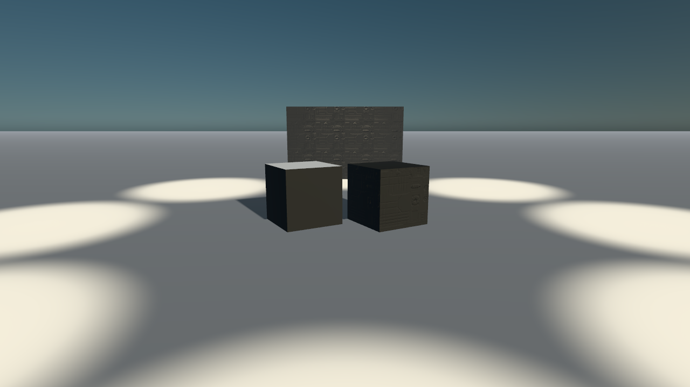

# Lane colour: the variation chain

The sixth design's lane colour (`docs/superpowers/specs/2026-10-10-bf2017-accuracy-design.md`, §1.1 and §3; plan `docs/superpowers/plans/2026-10-10-bf2017-accuracy-lane-colour.md`). What the game binds a surface with is three records: the mesh variation databases (each mesh's textures by parameter name, once for the default and once per variation), the object variations (a shader preset, plain-named tints and switches) and the shader depots (the compiled parameters, their names hashed). This folder holds the measure: how much of what each pack draws is bound as the game binds it.

## The audit

`node scripts/bf2017-material-audit.mjs <world>…` (per world: `<world>.md` lists every material that is not `bound`, and why). A drawn material is `bound` when every slot its level's databases bind is drawn with that texture: the GLB's own (the export bound the dump's), or the variation's own map in the pack. `default-only`: the game varies the mesh on this level and the pack draws its default. `missing-texture`: a texture the database binds has no KTX2 in the bucket and the GLB does not carry it either. `no-entry`: no database of the level lists the mesh.

<!-- audit:start -->
| world | level | materials | bound | default-only | missing-texture | unbound | no-entry | bound share |
|---|---|---|---|---|---|---|---|---|
| `hoth` | `levels/mp/hoth_01` | 864 | 804 | 52 | 7 | 0 | 1 | 93.1 % |
| `sb_endor` | `levels/space/sb_endor_01` | 387 | 358 | 26 | 3 | 0 | 0 | 92.5 % |
| `sb_kamino` | `levels/space/sb_kamino_01` | 693 | 672 | 20 | 0 | 0 | 1 | 97.0 % |
<!-- audit:end -->

**The gate (Hoth ≥ 95 % bound) is not met: 93.1 %.** What is left is almost all `default-only`: 24 of Hoth's meshes are placed both plain and varied on the level (the crate `Box_M_01_A` snowed in the outdoor base, dry in the hangar; the wall lamps lit, off and red; the blankets thermal and padded). A pack draws one material per mesh, so those keep their default. The fix is a split by instance: the level's records already give every static instance its variation (`InstanceObjectVariation`, filled, not empty as the design thought: Hoth_01's 7 members and Content's 42 carry hashes), and `variations.json`'s `instances` keeps each group's list, but the pack builder (`scripts/bf2017-level.mjs`, lane E0's) keeps no group per instance. Once it does, the scene can draw a mesh's instances in more than one material and these 52 turn `bound`.

Counted `bound` and worth knowing: 92 of Hoth's materials bind a texture whose own KTX2 is not in the bucket (mostly `_MSW` and `_RGB` masks), but the dump binds the same one and the export baked it into the GLB (an `_MSW` into its ORM). Counted strictly the share would be 82.4 %.

## The writer and the reader

- `node scripts/bf2017-variations.mjs <world> [--fetch]` writes `variations.json` beside the pack (Hoth 0.40 MB) and a "Variations" table in its README. Hoth: 601 meshes, 55 with variations, 20 drawn in theirs (every instance agrees), 24 mixed, 0 by the level's rule (no mesh qualifies once instances are read), 105 textures the databases name and the bucket lacks. Endor: 210, 15, 2, 3. Kamino: 343, 16, 5, 6.
- `levelVariations.js` hands each varied mesh's recipes their variation; `variation.js` reads its vectors and conditionals through Q1's own parameter names (a lit lamp's colour-typed `EmissiveIntensety`, a container's `PaintColour`, a wreck's switch), `gameMaterial.js` draws a variation's own colour and normal maps in place of the GLB's and snows a snow variation from the start (Q4's snow at its whole amount). A recipe without one draws exactly as before (its test).
- On the site this is inert until `galaxy-surface` runs the node renderer (lane T), as Q1 is: the classic renderer keeps the GLB's materials.

## The fixture

`node scripts/light-fixture.mjs --materials --variations --legs webgl --size 1280x720`: Hoth's crate twice, as the dump has it and in `Box_M_01_A_Snow` (the mesh is mixed on Hoth, so the fixture names the variation), at high and ultra (`crate-<tier>-webgl.png`, the features in `variations-webgl.json`). SwiftShader is enough for a material's difference; the WebGPU leg is the owner's laptop. The crate's snow mask (`T_Box_M_01_A_M`) is not in the bucket, so the snow lies on every up-facing face, not only where the mask says.

On the shot the snowed crate's top is white and its sides are flatter than the plain crate's: the plain one draws no feature (`variations-webgl.json`: `(none)`), so it is the GLB's own material, while the snowed one goes through Q1's node graph, whose base on this crate reads flatter on SwiftShader. That is Q1's path for any material with a feature, not the variation's; worth a look on the laptop's WebGPU leg.

The regression (Q1's fixture without `--variations`, `--size 1280x720`): the GLB and low shots match the committed ones (mean difference 0.0001 of 255); mid and high differ by 0.4 to 0.5, from Q1's own later change to the characters' detail arrays (`d0faeedb`, after those shots were taken), not from this lane, whose code a recipe without a variation never enters (its unit test). The run was cut off before ultra and its JSON report.

## The dictionary

`node scripts/bf2017-shader-names.mjs` writes `src/data/bf2017/shaderParams.json`: 2,003 names (the material dump's keys, 2,801 object variations' parameter names, 139 shader presets'), each with its djb2-xor hash of the lower-cased name. The depot probe (`maps_work/shaderdepots.jsonl`) is not in the bucket, so the resolved share by count (the gate: ≥ 90 %) is the desktop's to measure: `--depots <file>`. The same hash names the variations: `VariationAssetNameHash` and an object variation's `NameHash` are `hashName` of its lower-cased path.

## The vehicles

`bf2017-import.mjs --variations <MVDB record>` binds a model's maps from its database by parameter name, by material index, where the GLB lacks them. It cannot retire #866's hand table: the materials whose graph binds their maps (the AT-AT's `SS_ATAT_Head`, the Falcon landmark's details, legs and windows) have empty entries in every database scanned (553 under `Gameplay/` and `Levels/`), and the other materials bind exactly what the dump does (AT-AT 15 of 15, Falcon 1 of 1). `--textures` stays.
